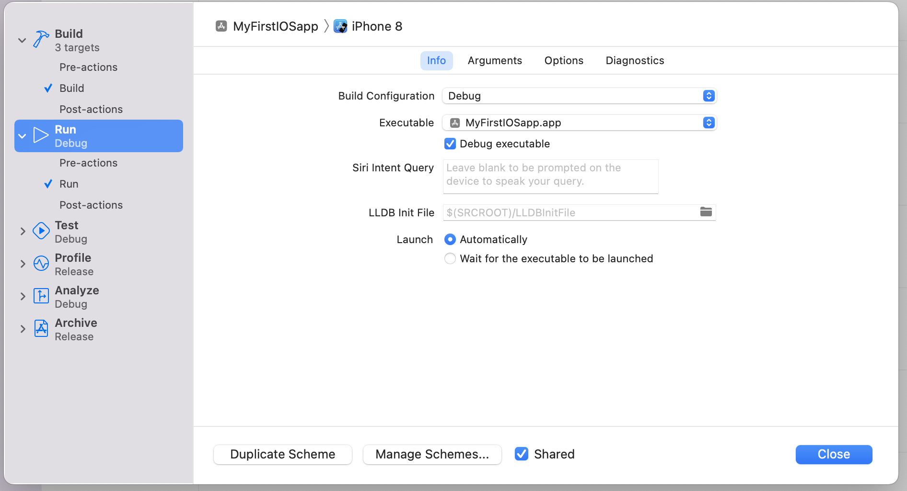

# Development Tools in XCode
1. Simulator - run app on a simulated iphone/ipad/apple watch/apple tv etc. [Simulator Help](https://help.apple.com/simulator/mac/current/)
2. Instruments - profiling, testing code, improve performance, spot memory issues. [Instruments Help](https://help.apple.com/instruments/mac/current/)
3. CreateML - training of custom ML models. [Create ML](https://developer.apple.com/documentation/CreateML)
4. 3D Content with **Reality Composer** - 3D compositions and AR. [Reality Composer](https://developer.apple.com/documentation/RealityKit/creating-3d-content-with-reality-composer)

- **Why is the organization identifier a reverse DNS string?**

- Why are Product name and Organisation identifier compulsory fields in Xcode?
     - used in creating the bundle ID
     - bundle ID used to register an App ID when this app is used on a device.
     - Org Identifier cannot be changed once build is uploaded to the App Connect.
        - `Can it be changed on the next build?`

- User Interface = SwiftUI if you want to an interactive preview of your app-code.

- [Cocoa Template extra configurations](https://developer.apple.com/documentation/xcode/managing-files-and-folders-in-your-xcode-project)
- **What is a group in XCode Project?**

- Group with Folder does appear if you see its path in terminal, group without folder doesn't appear as a disk.
        - the components(files) belonging to a group without folder will appear as files in the same directory as that where the group-without-folder was added to.
        - Groups without folders are used mainly to organize resources(source files etc. )  inside xcode , which is rather not required on disk.
        - [**Important**](https://developer.apple.com/documentation/xcode/managing-files-and-folders-in-your-xcode-project) Source control == version control.
        - Remove reference - removes them from Xcode, not from disk.
- [Why mutliple projects for your app are better than a single giant one?](https://developer.apple.com/documentation/xcode/managing-multiple-projects-and-their-dependencies)

# XCode - Build a project
1. [What is a target?](https://developer.apple.com/documentation/xcode/building-and-running-an-app)
2. Use of a new Target?
3. Use of a new Build Scheme?
**Note on Simulators**: provide quick turnaround times, but not the performance of an actual target device.
4. Project->run,Build,Debug. 
5. [Stop build, continue build after errors](https://developer.apple.com/documentation/xcode/building-and-running-an-app)
6. [add source files to a target](https://developer.apple.com/documentation/xcode/configuring-a-new-target-in-your-project)
7. [When can *Implicit Dependency* detection fail?(configure dependency between targets)](https://developer.apple.com/documentation/xcode/configuring-a-new-target-in-your-project)
8. **What's the usecase of a target-less build scheme?**
    1. Autocreate schemes option creates such scheme, **ANSWER STILL NOT FOUND**.
9. ***Correction to the title***, schemes are built, schemes are part of a project, schemes could point to one or more targets.
    1.  targets could be app,framework,app extension or UI testing.
10. Task serialization for dependency handling during build - Xcode builds a private framework before it builds the app that links against that framework.
11. [Build order - manual, dependency order, find implicity dependencies](https://developer.apple.com/documentation/xcode/customizing-the-build-schemes-for-a-project)
12. Background Fetch - async run your app to keep it updated to the latest state.
    1. for instance a news app will be run in background after the user has switched away from it, rather than waiting for app launch as the latter will take a few seconds to contact the server. 
    2. this background run is managed by iOS for proper battery utilization.


# Quick Tips
1. Right click on a part of a code and select Quick Help to open up the declaration for that class/function/element.
2. Command-click on an specific view in the preview mode to access structured editing , and in turn the SwiftUI inspector.
    1. Use this to customize that particular View.
    2. [List of SwiftuI Views](https://developer.apple.com/documentation/widgetkit/swiftui-views)
3. Command-Click on the line where the View is created also gives the option of opening the Inspector.

# Views
1. What is a protocol datatype?
2. [body: a computed property in the View protocol](https://developer.apple.com/documentation/swiftui/view/body-swift.property).
    1. ```Swift
        struct MyView: View {
            var body: some View {
                Text("Hello, World!")
            }
        }

        /* 2nd way */
        struct MyView_2: View{
            var body = Text("Hello World")
        }
        ```
    2. This style of returning a `some Protocol{}` is called returning an [opaque type](../learnSwift/README.MD#opaque_types).
    3. `body` actually belongs to the `Self.Body` type which is an [`associatedtype`](../learnSwift/README.MD#generics) of the Protocol `View`.
2. What are: @frozen, @propertyWrapper associated with a State(struct)?
3. Please visit [State and Data flow](https://developer.apple.com/documentation/swiftui/state-and-data-flow)        
    1. What is a source of truth in the context of state and app data storage?
4. Keep [this](https://developer.apple.com/forums/thread/652669) in mind while using View as a property of a structure.

# DocList
1. [MapKit](https://developer.apple.com/documentation/mapkit/)

# App Extensions
1. [Documentation](https://developer.apple.com/app-extensions/)

# Tutorial Links
1. [SwiftUI Tutorial - Apple Developer Documentation](https://developer.apple.com/tutorials/swiftui/creating-and-combining-views)