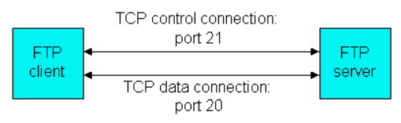

# Table of Contents

1. [Terminal Emulator](#te)
   1. [Teletype Machine](#tty)
   2. 
2. [SSH](#ssh)
   1. [ssh-keys](#ssh-keys)
   2. [ssh tunelling](#ssht)
3. [SFTP](#sftp)
   1. [FTP](#ftp)
   2. [SFTP steps](#sftp-steps)
   3. [Disadvantages of SFTP](#disadv-sftp)
4. [Monolithic architecture](#monolith)
5. [MicroService](#microservice)
6. [JWT](#jwt)


# Terminal Emulator<a name="te"></a>

1. the terminal that we all are accustomed to is usually referred to as the "terminal emulator" or "terminal emulation"
2. they’re not the same things as the command lines that they provide, .
3. berfore terminals , people interacted with a mainframe design(like a Unix system) using a teletype machine(tty)


## TeleType Machine<a name="tty"></a>

1. These machines work by sending frequency shift keyed tones over a transmission line in order to present textual data encoded in simple binary. 

2. These systems ultimately spawned the ASCII encoding that’s used for text files.

3. the VT100 was one of the most popular option that many terminal packages now represent in code

   1. These machines were ironically emulating teletype machines.

4. You also have the concept of a PTY pseudo-terminal. 

   1. This master and slave pair allows a piece of software like SSH or a GUI terminal to offer a terminal-like interface through a PTS to a user coming from a master called a PTMX. 

   2. When you’re running a GUI terminal, type the letter **w** and then push enter. 

      ```bash
       19:32:57 up  9:04,  4 users,  load average: 0.85, 0.85, 0.71
      USER     TTY      FROM             LOGIN@   IDLE   JCPU   PCPU WHAT
      laferrar tty7     :0               10:31    9:03m 19:33   0.58s /sbin/upstart --user
      laferrar pts/5    :0               10:36    1:12m  0.53s  0.53s /bin/bash
      laferrar pts/7    :0               13:00    6:31m  1:38  30.04s /usr/bin/python /usr/bin/terminator
      laferrar pts/8    :0               18:47    1.00s  1:11   0.00s w
      ```

   3. You’ll see that it claims you’re latest command came from a pts, which is the slave pair to the PTMX that’s running the show in the first place.
   
5. BSD and Linux distributions - virtual console/terminal = `Ctrl+Alt+F2`

   1. emulation of a full console with a keyboard and display using those same old protocols that a traditional terminal would use.
   2. This will more than likely seem rather confusing because all of these terms have sort of become intertwined to refer to modern command line environments.


# SSH - secured shell<a name="ssh"></a>

1. network layer protocol for secure remote login from one computer to another

2. secure alternative to the non-protected login protocols (such as [telnet](https://www.ssh.com/ssh/telnet), rlogin) and insecure file transfer methods (such as [FTP](https://www.ssh.com/ssh/ftp/) and remote copy, `rcp`).

3. client-server model
   1. ssh client establishes a connection with the ssh-server
   2. this client uses public key cryptography to verify the identity of the ssh server
   3. all data communicated between these 2 is then encrypted by usage of strong symmetric encryption and hashing algorithms
   4. 
   5.  An SSH server, by default, listens on the standard Transmission Control Protocol (TCP) port 22.
   
4. for a first-time connection attempt to a remote, the user will be prompted with the remote host's public key fingerprint and prompted to connect, despite there having been no prior connection:

   ```bash
   The authenticity of host 'sample.ssh.com' cannot be established.
    DSA key fingerprint is 01:23:45:67:89:ab:cd:ef:ff:fe:dc:ba:98:76:54:32:10.
    Are you sure you want to continue connecting (yes/no)?
   ```

   1. Answering *yes* to the prompt will cause the session to continue, and the host key is stored in the local system's known_hosts file. 
   2. This is a hidden file, stored by default in a hidden directory, called /.ssh/known_hosts, in the user's home directory. 
   3. Once the host key has been stored in the known_hosts file, the client system can connect directly to that server again without need for any approvals; the host key authenticates the connection.


## SSH-keys<a name="ssh-keys"></a>

1. having public-private keypair as part of authentication is more secure than simply a user -password combo
2. public goes on the server, private **should ** stay inside the localhost
3. server can check whether we actually have the private key associated with the public key that it holds
4. The biggest threat to SSH is poor key management. 
   1. Without the proper centralized **creation, rotation and removal** of SSH keys, organizations can lose control over who has access to which resources and when, particularly when SSH is used in automated application-to-application processes.


1. the open source **OpenSSH implementation** is the one most commonly found on Linux, Unix and other OSes based on Berkeley Software Distribution ([BSD](https://searchdatacenter.techtarget.com/definition/BSD-Berkeley-Software-Distribution)), including Apple's macOS.
2. PuTTY is another open source implementation of SSH, and while it currently is available for Windows, macOS and Unix/BSD, *PuTTY was originally written to run on Windows*. 
   1. It has long been one of the top options for using SSH on a Windows system.
3. most implementations, 3 main utilities - secure login, i.e. slogin, ssh(secured shell, i.e. terminal emulation of the remote host should be secure, all commands entered, output displayed for that command, all of this must be secured.) and scp(secured copy)


## SSH-tunneling<a name="ssht"></a>

1. also called **ssh-portforwarding**
2. enables a user to open a secure tunnel between a local host and a remote host.
3. redirecting network traffic to a particular port/IP address so that a remote host is made directly accessible by applications on the local host.
   1. hence when i port forward a jupyter-notebook **from my ADA to my local machine**, here the *remote is my local machine*, whereas the <u>localhost is the ADA machine</u>.
   2. the jupyter-notebook is hosted on the ADA machine itself, but my local machine, acting as a remote, is able to access it.
4. SSH tunnels are powerful tools for IT administrators, as well as malicious actors, because they can transit an enterprise firewall undetected. 
5. As a result, there are tools available to prevent unauthorized use of SSH tunnels through a corporate firewall.


# SFTP- secured file transfer protocol<a name="sftp"></a>

1. supports the full security and authentication functionality of SSH


## FTP - file transfer protocol<a name="ftp"></a>

1. network layer protocol to transfer files from 1 host to another over a **TCP-based** network
2. based on the client-server architecture
3. uses separate control and data connections between the client and server, hence 2 ports per FTP connection established
   1. The designers thought that the amount of data flowing over the data port would make it so that they couldn't send control commands in a timely manner, so they did it as two ports. 
   2. 
      1. When a user starts a FTP session with a remote host, FTP first sets up a control TCP connection on server port number 21. 
      2. The client side of FTP sends the user identification and password over this control connection. 
      3. The client side of FTP also sends, over the control connection, commands to change the remote directory.
      4. When the user requests a file transfer (either to, or from, the remote host), FTP opens a TCP data connection on server port number 20.
      5. FTP sends exactly one file over the data connection and then closes the data connection.
      6. If, during the same session, the user wants to transfer another file, FTP opens another data TCP connection. 
      7. Thus, with FTP, the control connection remains open throughout the duration of the user session, but a new data connection is created for each file transferred within a session (i.e., the data connections are non-persistent).
   3. Firewalls, and especially NAT, came much later.
4. [please watch this](https://www.youtube.com/watch?v=U0LzX_tTiNw)
5. password is not encrypted , all data sent in plain-text(file-transfer data), hence **FTP is susceptible to eavesdropping**. 
6. we can either connect to a file from the browser or using an FTP client-service
   1. type the address of the server from which the file is to be viewed/downloaded.
7. most popular FTP free client - filezilla


1. firstly to use a secured data transfer service, this protocol was adopted and replaced the traditional FTP
2. the same control channel is used for control and data connections, unlike FTP
3. the *ssh session* opened as part of this communication, acts as a privacy layer for this client-server connection.
4. public key cryptography used to validate the SSH-server
   1. to validate the client, either public-key cryptography or a password can be used.


## SFTP-steps<a name="sftp-steps"></a>

1. connection request from localhost to remote, i.e. the server
2. server responds with a welcome message with the highest available SSH-version available
3. the client then sends its SSH-welcome-message with the highest available SSH-version
4. the server responds with its supported algorithms and a small amount of random data as a session cookie
5. the client also sends its supported algorithms and a small amount of random data as a session cookie
6. the client then starts the key-exchange, *using the algorithm and parameters supported by both* (params to the algorithm), sends these parameters to the server 
7. the server responds with its parameters and its public key
8. the server computes a hash of the data communicated so far and signs it using its private key, this signature is sent to the client
9. the client also calculates the hash of all the data exchanged, it checks the signature from the server with the server public key
   1. if not matching, connection is dropped
10. connection is now encrypted, using the keys which will be generated from the common algorithms and common set of parameters
11. the client sends a user-id and password, the server authenticates this, replies if the access has been granted
12. the client then asks the server to start the SFTP subsystem, the server returns failure/success
13. the client sends its supported SFTP subsystem version, the server does the same
14. the client is now able to send requests for the required file operations
    1. the server checks for the permissions for the requested file operations, if allowed, the request is processed
    2. return success/failure


## Disadvantages of using SFTP<a name="disadv-sftp"></a>

- The communication is binary and can't be logged
- SSH keys are not easy to manage and validate
- The standards define specific things as optional or recommended. It may lead to compatibility problems between different software developed by different vendors.


# Monolithic architecture<a name="monolith"></a>

1. on *smushing* modules of a code into a single server(physically a collection of machines, this doesn't literally mean 1 machine)
2. complexity of code(w.r.t. its modular structure) needs to be handled at both the development-time and runtime
   1. monolithic isn't able to do this
3. the bigger the deployment, the more challenging it is
   1. suppose feature-to-be-added = Ads, 
   2. the entire testing(all previous modules) have to be tested, before being deployed
   3. since the entire application is being deployed on a server, every time an *update is made, we need to test the entire application*
4. has an issue of scalability
   1. on increased traffic, more instances of server would be needed
   2. since everything is deployed on 1 server, on *creating multiple instances of a server, **even all the functionalities have to be scaled up, i.e. duplicated on each server***, because the entire server represents the entire application
   3. lot of monetary cost incurred as a result.


# MicroService<a name="microservice"></a>

1. split up an application into smaller, min-applications
   1. deploy each of these on their dedicated servers, and allow communication between these servers
2. all these mini-apps would call each others REST-APIs to fetch the client's request
3. these *<u>mini-apps = microservices</u>*
4. risk of deployment is minimised
   1. suppose commerce-website = shopping-catalogue app, web-view app, profile-page app
   2. an update to the shopping-catalogue app will only be confined to it, hence only this app should be tested, since its separate from other min-apps
5. scaling is easier
   1. suppose traffic increases on the shopping-catalogue app
   2. only that app needs to be scaled, i.e. only the instance of a server that hosts that particular application is needed to be duplicated.
6. deployment flexibility - different groups can work on different mini-apps, which can be further split into teams working on each functionality of a mini-app.
7. technology flexibility - all mini-apps can be written in different/same technology, since they would in the end communicate using their APIs 
8. can be scaled separately
9. deployment/architecture complexity
   1. as an when more mini-apps are added, deployment of the complete app becomes more complex
10. service discovery
    1. the method in which these micro-services would *discover* each other.


# Json Web Token<a name="jwt"></a>

1. pronounced as "jawt"
2. secure communication, RFC 7519 - outlines how a JWT should be structured
3.  instead of returning a session id to each user that authenticates, it returns the user-information itself as a token, with a signature of the web-server
   1. a json-payload with the username-password returned as a token
   2. hence the server itself doesn't save anything
4. whenever a client makes a request to the server, the server checks whether a valid-signed token is sent by the client
   1. the token is nothing but the username-password sent in a secured manner
5. the security-issue regarding this is handled by matching the signatures
6. JWT - value tokens.
7. can be sent using cookies, can be saved in the local-storage of the browser 