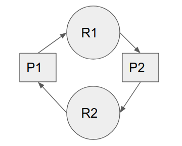

# Table of Contents

1. [Introduction](#deadlock-intro)
   1. [Resource Allocation Graph](#res-alloc-graph)
   2. [System Model](#system-model)
2. [Conditions for Deadlock](#deadlock-conditions)
3. [Methods for handling a deadlock](#deadlock-handling)
   1. [Deadlock Prevention](#deadlock-prevention)
      1. [Violating mutual exclusion](#violate-mutex)
      2. [Violate Hold and Wait](#hold-wait-violate)
      3. [Violating preemption](#violate-preemption)
      4. [Violate circular wait](#violate-circular-wait)
   2. [Avoidance](#deadlock-avoidance)
   3. [Detection and recovery](#deadlock-dar)
   4. [Ignorance](#deadlock-ignorance)

# Introduction

* In a **multi-programming system**, processes compete for resources and if a resource is not available, the process enters into waiting state
* if a process is unable to change its waiting state **indefinitely** because the resources requested by it are held by some other process, then the **system is said to be in a deadlock**.
* **Deadlock**: situation where a set of processes are blocked because each process is holding a resource and waiting for another resource acquired by some other process. 

### Resource Allocation Graph

1. edge from process to resource: process wants to acquire that resource
2. edge from resource to process: process already acquired that resource
3. 

this is referred to as *hold and wait*.

**each process** follows a **system model**

### System Model

1. every process will request for a resource(at-least 1 resource)
2. all resources are withheld by the OS, and it is the one who decides which process receives what resource
3. if request is entertained, then the process uses this resource
4. on completion, the process **has to release** the resource.

# Conditions for Deadlock

deadlock is bound to occur if the following **4 conditions occur at** the **same time**:

1. **Mutual Exclusion**
   1. one or more resources cannot be shared
   2. at-least 1 resource should be of non-shareable type.(for instance a printer is a non-shareable resource)
2. **Hold and Wait**
   1. process is holding at-least 1 resource and is waiting from some other.
3. **No preemption**
   1. resource cannot be taken from a process until it completes.
4. **circular wait**
   1. set of processes are waiting for each other in a circular fashion

# Methods for Handling Deadlock

## Prevention

1. If even any 1 of the 4 aforementioned conditions is broken, it is always ensured that deadlock will never occur.
2. this is called as deadlock prevention.
3. when deadlocks are frequent, and occurrence of even 1 deadlock is severe for the system
   1. for instance, consider scenario of building up a hospital(system), and providing it with electricity(occurrence of a power-blackout = deadlock)
   2. if deadlock occurs, then it would be a fatal scenario for some patients, hence we need to ensure that deadlock never occurs, i.e. keep a backup-generator ready at all times.
4. environment is created such that deadlock will never occur, forget about runtime and all.
5. COVID lockdown = prevention.

### Violating mutual exclusion

1. this is w.r.t. a resource, i.e. if a resource is accessible in a mutual exclusive fashion, then a deadlock might occur
2. since whether a resource is of type mutually exclusive, or whether it can be accessed by multiple processes at the same time cannot be changed/determined, **never possible to violate mutual exclusion**.

### Violating Hold and Wait

1. <u>conservative approach</u>
   1. process is allowed to start its execution(basically given CPU) only if it has acquired all of its resources(less efficient , not implementable, , easy to think of, deadlock independent)
   2. the basic idea is at-least one of the processes will receive all resources, hence start and finish execution, thus preventing deadlocks.
2. <u>do not hold</u>
   1. process will only acquire desired resources(what is necessary for partial execution), but before making any fresh request for acquiring resources, it must release all currently-withheld ones(efficient, implementable)
   2. it is guaranteed that there will be at least 1 process in the system getting all its desired resources, thus completing its execution in partial steps
   3. it may so happen that a process executed about , say 20% of its code, and at the time had acquired 4 resources - a, b, c, d.
      1. and for further execution, it needed e as well
      2. before requesting for e, it has to release a, b,c,d.
      3. if it gets **lucky**, it will get all of a,b,c,d,e.
      4. if not, some other process is bound to get all of its resources, hence its partial execution is bound to take place.
3. <u>wait timeouts</u>
   1. maximum time upto which a process can wait for acquiring resources, after which it has to release all of its held resources.

### Violating Preemption

1. preemption is only limited to high-priority and system processes
   1. only these processes are allowed to forcefully preempt resources from other low-priority processes and acquire them for themselves
   2. system process/kernel process refers to the processes of the OS itself, which exist to maintain the sanity of the system in the first place, and they shouldn't be the ones to cause deadlock(:laughing:) 
2. processes in the waiting state must be selected as a victim of preemption instead of processes in running state.

### Violating Circular wait

1. Algorithm
   1. assign a natural number to each resource
   2. allow every process to acquire resources only in the increasing order of the assigned numbers to these resources.
   3. if a process wants to acquire resource(s) having assigned values lesser than its currently acquired ones, then it has to **release all resources with number larger than this one**.
   4. all processes either have to request in **increasing** or **all of them should request in decreasing order**
2. problem - cannot determine beforehand which process will need what resource exactly
   1. **to tackle this** the numbering scheme is used.
3. hence, between a set of nodes - processes and resources, a DAG(directed acyclic graph) is created.
4. suppose 2 process 1, 2 and 2 resource a, b. 
   1. both 1 & 2 want a, b for execution
   2. assuming 1 gets assigned *a* first, 2 cannot receive *b* since it has requested for *a* and has to wait 
   3. thus 1 will also get *b*, thus it will finish its execution, after which 2 will get its pending request for *a* answered, then it will acquire *b* as well.
5. suppose a process 1 initially requires resources 1, 21, 41
   1. after some time, it found out that it needs resource 31 as well
   2. then, by principle, it has to first release 41, and only then can it acquire 31

Unless and until, its not given in the question, assume that **none of the 4 conditions can be violated**

Question: Suppose n processes  share m identical resource units, which are non-shareable in nature. The maximum resource requirement of   is  , where  . Then the sufficient condition for deadlock to be prevented is: each resource is allowed to acquire 1 less than its maximum desire, i.e. , and if sum of all these  &ge; m then deadlock will occur, hence the answer is: 

* this is because the worst case allocation of resources is all processes getting all but one of their total required resources, **holding** on to **them**, and at the same time **waiting for the last resource**
* this is what happened in case of 2 resource(a, b) 2 process(1, 2) problem,  where each of them held 2-1 = 1 resource and were waiting for the remaining 1 resource, thus arriving at deadlock , since there 2-1 + 2-1 = 2 == 2(total resources)
* this is logical right, if all of them have acquired all but 1 resource, and even if 1 resource is left after this assignment, that can be easily acquired by any of the existing processes , thereby preventing deadlock due to hold and wait.
* **if this condition is not held, deadlock is bound to occur**, thus respecting this condition ensures prevention from deadlock.

## Avoidance

1. prevention is not as efficient, as it consumes time, memory, is costlier to keep up with.
   1. prevention **puts different restraints on processes and resources**
   2. thus **resource utilisation suffers, throughput is less, system is slow** 
2. generally used for systems where
   1. either the deadlock is not that frequent
   2. deadlock effects aren't as severe
3. not as costly to implement as prevention(wearing masks, using sanitizers and gloves = avoidance), not as strict as prevention, deadlock is avoided at run-time.
4. don't let the system arrive into a deadlock state.
5. system maintains a set of data using which it takes a decision whether to entertain a new request(resource request by a process) or not to be in safe state.
6. Banker's algorithm used
   1. resource request(loan) is entertained only if its seen that there is any resource available(bank fund) to hand over to the process(although banks create money out of thin air when it comes to loaning, thus creating a *debt-based economy*)
   2. additional information about how resources will be requested is necessary + maximum number of resources of each type that it may need , to avoid deadlock

### Banker's Algorithm

* maximum need/demand of each process for each resource-type needs to be declared as soon as its enters the system, at runtime.

Maximum need table:

|      | E    | F    | G    |
| ---- | ---- | ---- | ---- |
| 0    | 4    | 3    | 1    |
| 1    | 2    | 1    | 4    |
| 2    | 1    | 3    | 3    |
| 3    | 5    | 4    | 1    |

Resource Allocation table

|      | E    | F    | G    |
| ---- | ---- | ---- | ---- |
| 0    | 1    | 0    | 1    |
| 1    | 1    | 1    | 2    |
| 2    | 1    | 0    | 3    |
| 3    | 2    | 0    | 0    |

Current Need

|      | E    | F    | G    |
| ---- | ---- | ---- | ---- |
| 0    | 3    | 3    | 0    |
| 1    | 1    | 0    | 2    |
| 2    | 0    | 3    | 0    |
| 3    | 3    | 4    | 1    |

System Max:

| E    | F    | G    |
| ---- | ---- | ---- |
| 8    | 4    | 6    |

Available:

| E       | F       | G         |
| ------- | ------- | --------- |
| 8-5 = 3 | 4-1 = 3 | 6 - 6 = 0 |

1. check feasibility of the process stack

   1. if maximum demand for any process w.r.t. demand of any resource exceeds total available instances of that resources, infeasible.
   2. here, the system is feasible.

2. resource allocation may be usually given in the beginning

   1. hence calculate `Current need[i, j] = MaxNeed[i, j] - Allocation[i, j]`

3. calculate total available resource-instances for each resource type

   1. `Avail[res] = System_Max[res] - sum(Allocation[:, res])`

4. determine if the system is in **safe state**

   1. at-least 1 process has to be satisfied with the available resource instances.

   2. here,processes: 

      1. 0 - yes, 
      2. 1 - no(instances of G required = 2, available = 0)
      3. 2 - yes
      4. 4 - no(instances of F and G required are greater than those available)

   3. suppose we choose 0 , and allocate it w.r.t. its need
      hence, Allocation : 

      |      | E    | F    | G    |
      | ---- | ---- | ---- | ---- |
      | 0    | 4    | 3    | 1    |
      | 1    | 1    | 0    | 2    |
      | 2    | 0    | 3    | 0    |
      | 3    | 3    | 4    | 1    |

      now 0 will run, complete, and free up all these resources, thus 

      Available:

      | E    | F    | G    |
      | ---- | ---- | ---- |
      | 4    | 3    | 1    |

      Current Need:

      |      | E    | F    | G    |
      | ---- | ---- | ---- | ---- |
      | 1    | 1    | 0    | 2    |
      | 2    | 0    | 3    | 0    |
      | 3    | 3    | 4    | 1    |

   4. now, only 2 can be run, thus handling it resources, and after its execution, 
      Available:

      | E    | F    | G    |
      | ---- | ---- | ---- |
      | 4    | 6    | 1    |

      Current Need:

      |      | E    | F    | G    |
      | ---- | ---- | ---- | ---- |
      | 1    | 1    | 0    | 2    |
      | 3    | 3    | 4    | 1    |

   5. now, any of them can be completed, and then after one of them is , the other will also be

5. hence our execution sequence was <0, 2,1,3> 

6. this corresponds to a **safe sequence**, since this sequence of resource-allocation can be carried out without any worries of deadlock(it leads to a **safe state**)

7. the system is safe for such a sequence, because **even if a process requests for its maximum requirement** at a certain point of time, still the system can suffice it and **will not go into deadlock**.

8. if the system is unsafe, **there is a possibility of deadlock**, but **its not certain, and is actually case-dependent.**

9. all in all, all of these data-structures have to be maintained to carry out this algorithm.

   1.  to maintain finished state of a process, *maintain a boolean array of n size, n = total number of processes.*

### Question

at time t1 = 1 = 5, 2 = 2, 3 = 3. total resource-instances = 12. tell if the state is safe or not?

|      | max need | Allocation | current need |
| ---- | -------- | ---------- | ------------ |
| 1    | 10       | 5          | 10 - 5 = 5   |
| 2    | 4        | 2          | 4 - 2 = 2    |
| 3    | 9        | 3          | 9 - 3 = 6    |

* the system is safe only if process-2 requests
* but **since it is not explicitly asked which of the processes will request for all required resources**, it may so happen that process-1 or process-3 request for full capacity, thus leading to deadlock.
* hence **the system is unsafe**.

## Deadlock detection and recovery

1. Let deadlock occur, then do preemption to handle it once occurred.

## Ignore the problem altogether 

1. If **deadlock is very rare**, then let it happen and reboot the system. 
2. This is the approach that both Windows and UNIX take. 