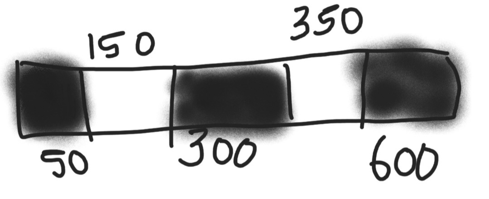
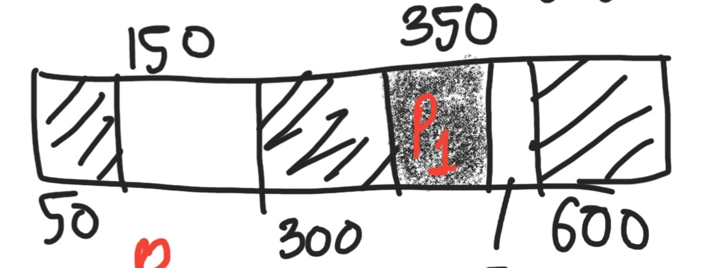
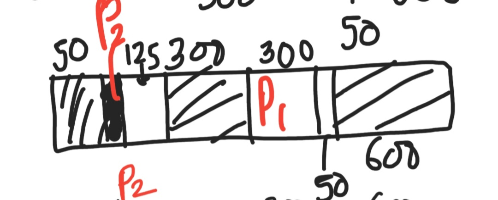
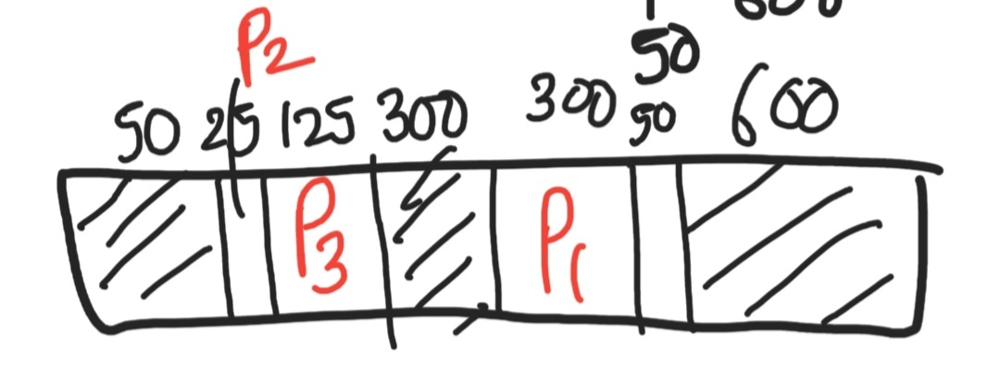
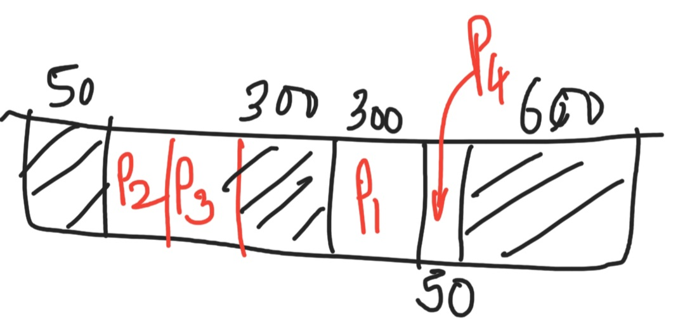

keywords - [external fragmentation](#ef), [internal fragmentation](#if)

# Table of Contents

1. [Introduction](#mem-manage-intro)
2. [Contiguous memory allocation](#contiguous-malloc)
   1. [Fixed-size partitioning](#fixed-size-partitioning)
      1. [First-fit in fixed-sized partitioning](#fffsp)
   2. [Variable-size partitioning](#variable-size-partitioning)
      1. [First-Fit](#first-fit-vsp)
      2. [Best-fit in variable-sized partitioning](#bfvsp)
3. [Non-Contiguous memory allocation](#non-contiguous-malloc)
4. 

# Introduction

1. factors that influence memory
   1. size: a memory with a larger size - desirable
   2. access-time: a memory with a small access-time - desirable
   3. per-unit cost: a memory with a small per-unit-cost  - desirable
2. as size increases, the access-time also increases(simply because the search space is larger), hence need to find some optimum between them
3. hence, instead of having a single piece of memory we have a duality
   1. cache memory + main memory + secondary memory
   2. cache < main < secondary(size, access-time)
   3. the access-time is controlled by something called as **locality of reference**
4. locality of reference
   1. since usually the **instructions** of a program are **executed in a sequential manner**, the program that resides in the secondary memory(disk memory) is usually brought into the main memory(RAM), since the access-time of RAM(micro-seconds) is much less than that of secondary memory(milli-seconds)
   2. this pre-fetching of following instructions into the main-memory = locality of reference
5. main-memory data can be brought into the cache, as a way of decreasing the access-time even further

# Contiguous memory allocation

1. data belonging to the same program(instructions) residing into the secondary memory, has to be stored in the main-memory in a contiguous manner, i.e. the space in which this program will be brought should be one single sequence of physical addresses, and not fragments
2. a problem can occur as follows
   1. let the main-memory be 10KB, such that 4KB(free)+2KB(occupied)+4KB(free)
   2. let the instructions of the program be of a total 5KB
   3. hence this program cannot be allocated in a contiguous manner
   4. this is called **external fragmentation**
3. the benefits of this method are
   1. access is simplified, since only the base address is to be remembered, and with accessing the location `base+offset` some particular location can be easily accessed
   2. address translation is **easier** since we only need to translate the base-address

## Fixed-size partitioning

1. partition the RAM into fixed-size partitions
2. each partition can have different sizes, but their capacity is fixed
3. hence 10KB = 5KB + 2KB + 2KB + 1KB
4. a partition cannot be further divided, it is to be allocated as a whole
   1. thus if a program of size 3KB enters, it has to be allocated to the 1st 5KB slot only
   2. hence the remaining 1KB is wasted
   3. this wastage of partitions due to not being completely occupied - **internal fragmentation**
5. this 1KB cannot even be allocated to any other program/process which may have a requirement of less than 1KB
6. easier to implement than variable-sized partitioning

## First-fit in fixed-sized partitioning

1. memory status: 200 + 400 + 600 + 500 + 300 + 250(all blocks are vacant)
2. processes - P1(357), P2(210), P3(468), P4(491)
3. hence P1 occupies 400 block, remaining = 43
4. P2 occupies 600 block, remaining = 390 units
5. P3 occupies 500 block, leaving 32 units
6. P4 **cannot occupy any of the blocks** - external fragmentation
7. internal fragmentation = 43 + 390 + 32 = 465 units
8. external fragmentation = 491 units, since this is not allowed to be allocated

## Best-fit in fixed-sized partitioning

1. memory status: 200 + 400 + 600 + 500 + 300 + 250(all blocks are vacant)
2. processes - P1(357), P2(210), P3(468), P4(491)
3. hence P1 occupies 400 block, remaining = 43
4. P2 occupies 250 block, remaining = 50 units
5. P3 occupies 500 block, leaving 32 units
6. P4 can occupy 600 block, leaving 109 units
7. internal fragmentation = 43 + 50 + 32 + 109 = 234 units
8. external fragmentation = 0 units, since all processes have been allocated

## Worst-fit in fixed-sized partitioning

1. memory status: 200 + 400 + 600 + 500 + 300 + 250(all blocks are vacant)
2. processes - P1(357), P2(210), P3(468), P4(491)
3. P1 occupies 600 block, remaining = 243 units
4. P2 occupies 500 block, remaining = 290 units
5. P3 occupies **nothing**
6. P4 occupies **nothing**
7. internal fragmentation = 243 + 290 = 533 units
8. external fragmentation = 468 + 491 = 959 units
9. hence **worst fit performs the worst for fixed-size partitions**

## Variable-size partitioning

1. let 10KB = 4KB(occupied)+6KB(vacant)
   1. then if a process having requirement = 3KB arrives, its given this after 4KB, thus a 3KB slot is still vacant.
2. no partitions technically
3. as and when processes arrive, contiguous memory is allocated to them, according to their need
4. no chance for internal fragmentation, since no fixed size, which later cannot even be re-assigned,  is being allocated
5. obviously suffers from external fragmentation
6. comparatively difficult to implement, w.r.t. fixed-size partitioning

## First-Fit in variable-sized partitioning

1. status of memory:
   1. 
   2. processes - P1(300), P2(25), P3(125), P4(50)
2. use the first block that is **capable enough of fitting some incoming process**
   1. hence the block of size 350 can accommodate this, leaving 50 units
      
   2. the block of size 150 can accommodate the next process, P2, having a requirement of 25 units, hence the remaining block-size = 125 units
      
   3. this block itself can accommodate the next-in-line process, P3
      
   4. the remaining 50 units block in the 350-unit original block can now be used
      

## Best-fit in variable-sized partitioning

1. memory status:
   
2. processes - P1(300), P2(25), P3(125), P4(50)
3. find the **smallest block that can satisfy memory requirement**
4. block of 350 units will accommodate P1, thus 50 units are remaining
5. block of 50 units from 4. will accommodate 25 units of P2, thus 25 remains
6. block of 150 units will accommodate P3, of 125 units, thus 25 units remain from this block
7. here, although a total of 50 unit-space is available, its in the form of **fragments**, thus **best-fit suffers from fragmentation**
8. this is because of the **variable-sized ** nature of partitions

## Worst-fit in variable-sized partitioning

1. memory status:
   
2. processes - P1(300), P2(25), P3(125), P4(50)
3. find the **largest block that can accommodate** an incoming process
4. this theoretically works better than best-fit, the reason being, the space that is left from the worst-fit block can be re-used again, and in best-fit case, the probability that the space left can be re-used properly is itself very less, since the space left is very less.
5. block of 350 units will accommodate P1, thus 50 units are remaining
   
6. block of 150 units will accommodate 25 units of P2, thus 125 remains
   
7. block of 125 units from 6. will accommodate 125 units of P3
   
8. the remaining block of 50 units in 5. will accommodate P4
   

# Non-Contiguous memory allocation

1. when the data is not stored in a contiguous manner, but in a **fragmented** manner
2. a linked list is a typical example of this
3. we cannot access any node in an O(1) manner, since the memory is not contiguously allocated, and from a node, we only know which is the next node that it points to
4. **this memory is allocated in this linked list fashion, usually**
5. hence, **access time increases**
6. **no external fragmentation**
   1. let the main-memory be 10KB, such that 4KB(free)+2KB(occupied)+4KB(free)
   2. let the instructions of the program be of a total 5KB
   3. this can now be stored as 4KB + 1KB, with the 4KB portion storing the base address of the location  where the remaining 1KB of the program is stored.
7. 