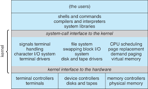
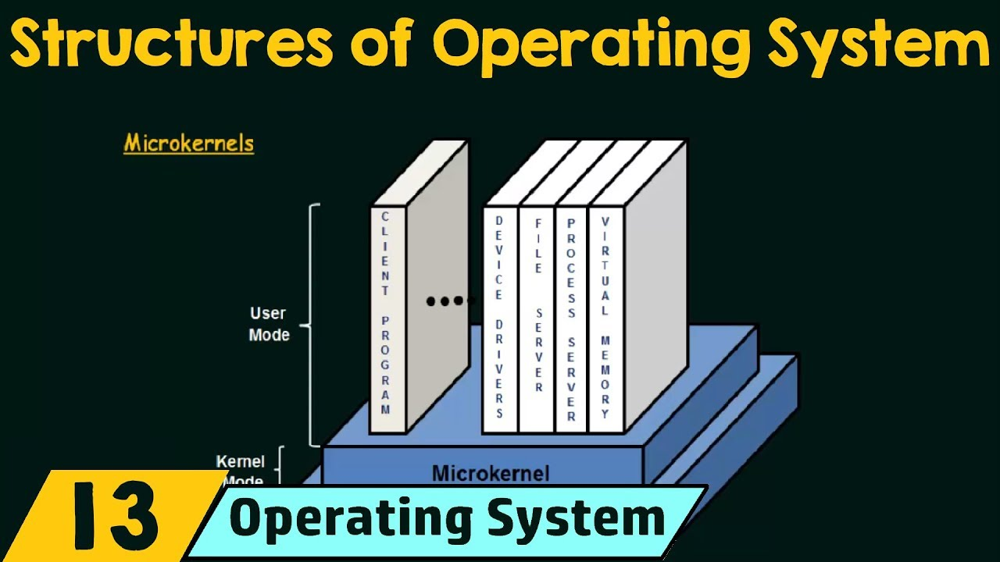
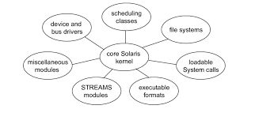

# Table of Contents

1. [Need for an OS](#os-need)

2. [Goals of an OS](#os-goals)

   1. [Mechanism](#mechanism)
   2. [Policy](#policy)

3. [Structure of an OS](#os-structure)

   1. [Monolithic structure](#monolith)
   2. [Layered structure](#layered)
   3. [Microkernel](#microkernel)
   4. [Modules](#modules)

4. [Important terms regarding OS](#important-terms)

5. [Interrupts](#interrupts)

6. [I/O structure](#iostruct)

   1. [I/O operation](#i/o-operation)

7. [Multi-programming](#os-multiprogramming)

8. [Time sharing operating system/multi-tasking](#os-time-sharing)

9. [Multi-processing](#os-multiprocessing)

   1. [Symmetric multi-processing](#symmetric-multiprocessing)
   2. [Asymmetric multi-processing](#asymmetric-multiprocessing)
   3. [Graceful Degradation](#graceful-degradation)

10. [System calls](#syscall)

   1. [User mode](#user-mode)
   2. [Kernel Mode](#kernel-mode)
   3. [Types](#syscalls-types)

11. [System Programs](#system-programs)

12. [System Boot](#sysboot)

13. cdaxc

14. dc

15. dcdac

16. dasc

17. 3. 

     

     

     

A modern general-purpose computer-system:

1.  &ge;1 CPUs with devices having controllers that are connected through a common bus to the shared--main-memory
2. 
3. each device controller is in charge of a specific device-type
4. CPUs and device controllers can execute concurrently, competing for *memory cycles*
5. a memory controller is used to *synchronise shared memory access* among various controllers and CPUs

# Need for an OS

1. intermediary between hardware and user
   1. user commands relayed to OS, OS conveys them and uses hardware appropriately
   2. so as to conveniently use hardware, or else everybody has to learn assembly/machine code writing
2. manages the resources in an unbiased fashion between both the hardware and software
   1. cpu, memory, buses.
   2. 
3. install OS on hardware, install all application programs on the OS
   1. provides a platform on which other application programs can be installed
   2. advantage is OS has to handle resource sharing between the currently running application programs
   3. **single-window operation** : only OS can access hardware, rest all application programs have to request resources from OS
4. 

# Goals of an OS

1. primary goal
   1. user friendly
   2. reach to user-base should be high, hence the system has to be as simple as it can be.
   3. although linux is efficient, generally, more widespread is the usage of MacOS/windows , since these are more user-friendly .
2. secondary goal
   1. efficiency
   2. designer-oriented goals
   3. easy to design and implement, operate, maintain, flexible, reliable, error-free

## Mechanism

1. determine how to achieve a goal.
2. **important principle** - always better to **separate mechanism from policies**
   1. this means that change in policy should not affect the mechanism, or rather the mechanism should be *flexible enough to accommodate a change in the policy*
   2. take the example of driving a car
      1. policy - speed limit is 40kmph, mechanism - engine+wheels+etc. that causes the car to move.
      2. instead, think of the mechanism be composed of components such that they guarantee that the speed is exactly 40kmph, and now if the policy is changed to speed-limit=30kmph, then the mechanism has to be changed, since it was tailor made to meet the requirements of the policy, and wasn't flexible w.r.t. policy in the first place.
3. consider resource allocation to a process
   1. mechanism - the algorithm of resource allocation itself
      policy - whether to allocate the resource to the requesting process or not
      hence in this case, if policy returns true, i.e. do allocate the resource, then mechanism takes control and allocates the resource to this requesting process

## Policy

1. determine the goal itself

# Structure of an OS

## Monolithic structure

1. 
2. clearly see that OS and kernel are not the same here
3. bottom-most layer - hardware
4. too many implementations packed into the kernel, makes its implementation and maintenance difficult

## Layered Structure

1. 
2. easy to implement and debug, every layer has different functionalities
3. if 1 layer has a problem, only need to handle/debug that layer
4. designing is tough, hierarchy of layers is very important.
5. the communication time between layers is long, if there are many layers present, i.e. if the outermost layer of a user-program requests some hardware resource for an I/O , the request(**syscall**) has to go till the last layer.
6. hardware layer is protected from the user-programs.

## Microkernel

1. 
2. as we can see, user-mode(system programs) processes large functionalities, while kernel mode(privileged) has small but highly important(*core*) functionalities
3. kernel mode sits between the user-mode and hardware, and it will decide whether to allocate any resource.
4. another function of micro-kernel - communication between client program and different system programs(device drivers, file server, process server, virtual memory), - message passing 
   1. hence the client program will be ran in user mode, and to access any of the functionalities like device drivers, it can stay in the user mode
5. performance decrease due to huge overhead in system function - too many message passing between client programs and other system programs in this structure

## Modules

1. 
2. best methodology for OS design
3. OOP , modular kernel
4. all functionalities present in the form of modules, loaded to the kernel either at boot-time or run-time, hence functionalities are *dynamically loaded* as per need.
5. each of these has a defined protected interface, more flexible than a layered structure however, since direct communication between modules can occur

## Functionalities of an OS

* to implement the goals, OS should provide these features
* process management
* memory management
* I/O device management
* File management
* Network management
* Security & Protection

# Important terms regarding OS

1. **boostrap program**
   1. the first program that is executed on starting a computer
   2. stored in ROM(read only, EPROM-erasable programmable ROM, EEPROM- *electrically* erasable programmable ROM)
   3. responsible for loading the OS kernel from memory and starting to execute it.
2. **Interrupts**
   1. occurrence of an event usually signalled by this
   2. this is carried out either the hardware of the software
   3. **hardware** may **trigger** an **interrupt** at **any time** by *sending a signal to the CPU*, usually through the system bus
3. **System calls**
   1. when an **interrupt** is **triggered by a software**, a special call is executed, called system call
   2. also called **monitor call**

# Interrupts

1. It may be either clicking a mouse, dragging a cursor, printing a document etc the case where interrupt is getting generated.
2. In I/O devices one of the bus control lines is dedicated for this purpose and is called the *Interrupt Service Routine (ISR)*.
3. whenever an interrupt occurs, CPU stops its actions immediately and transfers execution to a fixed location in the memory
   1. this fixed location = starting address where the service routine of the interrupt is located.
   2. the interrupt service routine executes, and on its completion, the CPU resumes the interrupted computation.

# I/O structure

1. each device controller maintains
   1. a local buffer storage
   2. set of special purpose registers
2. a device driver for each type of device controller
   1. understands the device controller and presents a uniform interface of the device to the rest of the OS.

## I/O operation

1. device driver loads appropriate [registers](#spr) within the device controllers
2. device controllers examines the contents to decide what action to take
3. controller starts the transfer of data from device to its [local buffer](#lbs)
4. once complete, controller sends out an *interrupt* to inform the driver about the same
5. driver then returns the control to the OS
6. this form of **interrupt-driven I/O transfer** is fine for small data-transfers but **incurs a huge overhead for  bulk data-transfers**
7. thus **DMA**(direct memory access) was brought in
   1. transfer of data from/to main-memory to/from its own [local buffer](#lbs) with **no intervention from the CPU**
   2. 
   3. here only 1 interrupt generated , per block of data transferred(as opposed to the interrupts that were happening at per byte of data transferred), to inform the driver about this transfer itself
   4. now the CPU is available for other operations, earlier it was busy in relaying out so many interrupts

# Multi-programming

1. maximum CPU utilisation
2. main memory contains the OS as well as a list of processes ready for CPU usage
3. an idle CPU will fetch any of these processes, complete execution till I/O point, after which the process is put back into the main memory for these I/O operations to take place
   1. the CPU is again idle now, hence repeat these steps
4. since more than 1 processes exist in the main-memory = MULTI-PROGRAMMING.
5. less waiting time, less response time, extended to multiple users on the same system
6. difficult scheduling, main memory management required, memory fragmentation, paging(non-contiguous memory allocation)

# Time sharing operating system/multi-tasking

1. multi-tasking is multi-programming with time-sharing
2. context switching occurs so quickly that it seems all programs are run on the same processor
   1. each process is given a time-quantum of CPU time, after which context switching will take place
3. 
4. this may also refer to **multi-threading of the same program**
5. better response time

# Multi-processing

1. single CPU unable to cope up with the current process load
   1. hence use multiple-CPUs
2. sharing the system bus, memory and other I/O devices
3. different processes may run on different CPUs , hence 
4. 2 types
   1. symmetric
   2. asymmetric
5. <u>Advantages</u>
   1. increased reliability
   2. increased throughput
   3. cost saving - only chip duplication, no i/o devices/disk duplication necessary()
   4. battery efficient - load dependent power consumption, since higher load - more CPUs in use, hence more battery consumption, but all CPUs aren't used at all times.
   5. true parallel processing
6. disadvantages
   1. overhead and coupling throughput
      1. mutual waiting of processors for un-shared resources
      2. some speed wasted in coordinating processes in-between multiple processors
   2. large main memory required.

## Symmetric multi-processing

1. all CPUs are of equal importance
2. all CPUs can access all possible resources
  

## Asymmetric multi-processing

1. 1 CPU master, rest n-1 - slaves
2. not all CPUs have equal rights of accessing all resources
3. system tasks on 1 processor, user tasks on another
4. 1 CPU may handle all hardware interrupt or I/O devices, easy to design, less-efficient.
5. **more popular, since easy to implement architecture**

## Graceful Degradation

1. in multi-processing, even if some CPUs are down, the system still can function, although at a lower throughput
2. in uni-processing, if CPU down, machine down
3. degradation is *graceful* hence

# System Calls

1. provides an interface to the services made available by an OS
   1. `read()`, `write()` : file-I/O syscalls

## User-Mode

1. programs(or processes) being  executed in this mode don't have direct access to memory, hardware and other resources
2. safer mode, since even on crashing, a process in this mode doesn't make the system crash
3. most of the programs in this mode
4. the calls through which such processes request for resources -----> syscalls
   1. for this small time, process switches to kernel mode---> context switching
   2. after using the resources, back to user mode
5. usually routines written in C/C++.

## Kernel Mode

1. programs(or processes) have access to all resources
   1. hence process is being run in a **privileged mode**
2. if such a process happens to crash, entire system also crashes,halts , restart the system

Case : transfer contents of a file from source file to destination file

1. each of the steps below requires a syscall
2. acquire input filename
3. write prompt to screen
4. accept input
5. acquire output filename
6. write prompt to screen
7. accept input
8. open input file
9. if file doesn't exist, ABORT.
10. create destination file
    1. if file exists, ABORT, since we want to create a new file
11. read from input---> write to output } loop
12. close output file
13. write completion message to screen
14. terminate normally(`return 0`)

## Types of syscalls

1. 5 major categories
   1. process control
      1. used to control processes
      2. `end, abort, load, execute, create_process, terminate_process, wait, signal, allocate_memory, free`
      3. end - normal termination, abort - terminate with some error
   2. file manipulation
      1. `create file, delete file, open, close, read, write, reposition, get attributes, set attributes`
   3. device management
      1. `request_device, release_device, get_device_attributes, set_device_attributes`
      2. logically attach/detach devices(physically attached means physically usb is connected, logically means that the OS needs to be aware that such a usb device is connected, hence should show up some where.)
   4. information maintenance
      1. `get` **`time`**  , `get_date`,  `device attributes, getsystemdata, setsystemdata`
   5. communications
      1. comms between different devices/different processes
      2. create, delete communication connection
      3. send/receive messages
      4. transfer status information
      5. attach/detach remote devices

# System Programs

1. look at this [diagram](#os-need)
2. provide environment convenient for development and execution
3. some may be simple interfaces to system calls, others may be more  complex
4. Types
   1. File management - create, delete, copy, rename, print, dump, list contents of files
   2. status information - date, time, amount of disk space(free, occupied, total), number of users, logging, debugging information etc.
   3. file modification -  deals with modifying the inner contents of  a file, contrary to file-management, that is responsible for creation/deletion and outer contents of a file
   4. *programming language support* - compiler, assemblers, debuggers, interpreters
   5. program-loading an execution - absolute/relocatable/overlay loaders, linkage editors
   6. communication - create virtual connection among processes, allow users to send messages to one another's screens, browse webpages, send emails, log in remotely or to transfer files from one machine to another

# System Boot

1. kernel to be loaded at boot up, starting the system = booting
2. bootstrap program knows where the OS is, and how to load into memory.
3. bootstrap loader/program in ROM/EPROM.