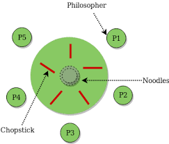

# Table of Contents

1. [Race condition](#race-condition)
2. [Critical Section Problem](#csp)
3. [Using turn variable to solve CSP](#turn-CSP)
4. [Using flag variable to solve CSP](#flag-CSP)
5. [Peterson's solution](#peterson-csp)
6. [Semaphores](#semaphores)
7. [Producer consumer problem](#producer-consumer)
8. [Reader-Writer Problem](#reader-writer)
9. [Dining Philosopher's Problem](#dpp)
   1. [Limit number of philosophers on the table at a time](#limit-philosophers)
   2. [allow 6 chopsticks instead of 5](#allow-more-chopsticks)
   3. [allow philosophers to hold either both or none of the required chopsticks](#allow-both-or-none)
   4. [Order of chopstick picking](#order-chopstick-picking)


# Race condition<a name="race-condition"></a>

* when multiple processes want to access a non-shareable resource, to decide which process will first get to do so is basically what is meant by process synchronisation
  * synchronised way of accessing non-shareable resources.
  * for instance, the bus that carries 0's and 1's signal along the ethernet connection is carrying a variety of data, say if someone is accessing facebook.com and at the same time downloading some movie, to organise the exchange of these bits from requesting client to server and back is a *real-time example of process synchronisation*
  * in the above example *the ethernet wires act as the non-shareable resource, behind creation of the ace condition*
* suppose variable: `a` is non-shareable resource, process P1 = `read(a); a+=1;write(a);` and process P2 = `read(a); a -= 1;write(a);`
  * let a = 10 initially, if P1 occurs completely, followed by P2, or vice-versa, we are left at the end with `a=10`
  * but if P1 occurs till `a+=1`, such that the local stack of P1 has `a = 11`, but then a sudden context switch is made to P2, and it is executed entirely, thus making `a=9`, after which the control is returned back to P1, **which writes `a` back as 11, since in its local stack it had a = 11.**
  * this is an example of **race condition(order of execution of processes change the main result)** and the **part of process that accesses such shared resources ** is called **critical section**
  * hence , in this case, the entire process codes represented full-blown critical sections.


# Critical Section Problem<a name="csp"></a>

1. the instructions-set of a process during which it wants to access shared resource(s)
2. a solution to this problem should satisfy 3 main criteria
   1. mutual exclusion
      1. CS to be accessed in ME fashion
      2. **mandatory criteria**
   2. progress
      1. consider only those process who **actually want to enter into their own CS**
      2. hence, running a pool of processes in round-robin fashion **does not satisfy this** since not all processes in this pool actually want to access their CS.
      3. **mandatory criteria**
   3. bounded wait
      1. maximum bound on the waiting time of a process that is waiting to enter into critical section
      2. 
      3. *optional criteria*


# Turn variable to solve CSP<a name="turn-CSP"></a>

1. ```cpp
   // turn is a global variable across processes
   turn = 0;
   
   // p0
   while(1){
       while(turn!=0);
       // cs
       turn = 1;
       // remainder section = rs
   }
   
   // p1
   while(1){
       while(turn!=1);
       // cs
       turn = 0;
       // remainder section = rs
   }
   ```

2. `while();` means a trap, i.e. an infinite loop

   1. hence, if a CPU does context switch to this section of the process, the process will use up its time quantum doing absolutely nothing(trapped in this while loop), and then context switch will happen away from this process.

3. at the start, since `turn=0`, `p0` enters it CS

   1. suppose being amidst its CS, CPU is preempted from P0 and given to P1
   2. still P1 will fall into the trap(`turn == 0`,hence `turn!=1`), and after its time-quantum expiration, the CPU will be given back to ready-state processes, i.e P0

4. P0 will complete its CS, and thus change `turn=1`

   1. now, if P0 wants to enter into CS again, as soon as `turn` is modified, it can't, as it will fall in its trap
   2. now if control is preempted to P1, P1 can easily enter CS since `turn==1`

5. for more than 2 processes, when `turn = index-of-process(id)` only then that process is allowed to enter into its CS.

6. this solution **satisfies mutual exclusion property** for a candidate solution for a CSP.

7. here, a cyclic trend is created

   1. for only 2 processes P0 and P1, only after P0 has accessed its CS is P1 even allowed to do the same, and only after P1 has accessed its CS can P0 **again** access its CS.
   2. this **does not follow a progress criteria**, since it may so happen that P0 may not want to enter into its CS, thus barring P1 to do the same.
   3. this solution **imposes strict alternation**.

8. even for more than 2 processes, suppose just after the CS code, `turn = random({set of pids}-current_pid)` actually will force the process with pid = turn to go through its CS, even if it doesn't want to, so that some other process may get a chance later.


# Flag variable to solve CSP<a name="flag-CSP"></a>

1. in the **turn variable solution** it was never asked to a process, whether it wants to enter into its CS.

2. ```cpp
   // turn is a global variable across processes
   flag = {false, false};
   
   // p0
   while(1){
       flag[0] = true;
       while(flag[1]);
       // cs
       flag[0] = false;
       // remainder section = rs
   }
   
   // p1
   while(1){
       flag[1] = true;
       while(flag[0]);
       // cs
       flag[1] = false;
       // remainder section = rs
   }
   ```

3. `flag[i] = true` signifies whether process-i wants to enter into its CS.

4. suppose P0 wants to enter into its CS first

   1. it makes `flag = {true, false}`, followed by trap, in which P0 doesn't fall since the flag-array keeps the information that P1 doesn't want to enter into its CS
   2. P0 carries out with its own CS execution
   3. then `flag = {false, false}`, and now if P1 wants it can easily enter into its CS.

5. hence the *cyclic dependency* is broken, which was observed in turn-variable solution.

6. this solution **ensures mutual exclusion** as no 2 processes can actually access their own CS at the same time.

7. suppose P1 wants to enter into its CS first

   1. it makes `flag = {false, true};` then enters and exits the trap, easily executes its CS and makes `flag = {false, false}`
   2. if suppose P1 was preempted after `flag = {false, true};`, to P0, after its first line, `flag = {true, true}`
   3. now if the next line of P0 is executed, P0 falls into a trap, and after its time-quantum expiration the control is preempted back to P1 and it will also fall into a trap.
   4. thus **deadlock occurs** in this solution
   5. this is because of **trying to achieve progress criteria**

8. hence **progress** is also **not satisfied**


# Peterson's Solution<a name="peterson-csp"></a>

1. use **both turn and flag**

2. ```cpp
   // turn is a global variable across processes
   flag = {false, false};
   turn = 0;
   
   // p0
   while(1){
       flag[0] = true;
       turn = 1;
       while(turn == 1 && flag[1]); // initially it was turn != 0, which means turn == 1
       // cs
       flag[0] = false;
       // remainder section = rs
   }
   
   // p1
   while(1){
       flag[1] = true;
       turn = 0;
       while(turn == 0 && flag[0]); // initially it was turn != 1, which means turn == 0
       // cs
       flag[1] = false;
       // remainder section = rs
   }
   ```

3. suppose P0 starts executing

   1. `flag = {true, false}`, followed by `turn = 1`, it doesn't fall into the trap since `flag[1] == false` enters into its CS, exits and makes `flag = {false, false}`
   2. now suppose the control is transferred to P1, it makes `flag = {false, true}`, followed by `turn = 0` , it doesn't fall into the trap since `flag[0] == false`, enters into its CS, exits and makes `flag = {false, false}`
   3. while P0 was executing, suppose context was switched to P1 after `turn = 1`, then if P1 reaches the trap, it will get trapped in that while loop, and after its time quantum expiration, control will be handed over back to P0, which can safely enter into its own CS, since `turn == 0` thus avoiding the trap

4. suppose context switch happens before P1 enters into its trap statement, and control is given back to P0

   1. now we would be entering into the trap statement of P0, with `flag = {true, true}` and `turn = 0`
   2. thus the trap is avoided since `turn == 0`

5. we can clearly see that

   1. **`turn`** *makes sure* that execution of CS is in a *mutually exclusive* fashion, as `flag[0]` and `flag[1]` both can be true, but `turn` will only *have 1 value*.
   2. **`flag`** on the other hand is used to **break the cyclic nature(strict alternation) of turn-variable solution**, thus **ensuring progress**, i.e. if suppose P0 never wants to enter its CS again, after it has entered once, P1 can still enter, since it is not bound by any cyclic pattern of execution, contrary to the turn variable solution.

6. this solution **also suffices** the optional criteria of **bounded wait**

   1. at-least one of the processes will enter into its CS, and if suppose a chain of events = {busy-wait of P1, CS of P0} occurs, this will eventually break off, after P0 exits its CS
   2. hence P1 has to remain in a waiting state only till the time P0 completes its CS
   3. hence no infinite wait is mandated.


# Semaphores<a name="semaphores"></a>

1. can be used to order the execution among processes, apart from solving the CS problem

2. can be used for resource management

3. peterson's solution was valid to only 2 processes, this can be generalised to n processes in the system.

4. ```cpp
   s = 1;
   wait(s){
       while(s <= 0);
       s = s-1;
   }
   signal(s){
       s += 1;
   }
   // Pi
   do{
       wait(s);
       // cs
       signal(s);
       // remainder section
   } while(1);
   ```

5. `wait`  serves as a trap statement

6. the first process that accesses the CS makes s = 0 due to `wait(s)`

   1. hence if the control is midway preempted to any other process in the system, that process will waste time in busy wait, due to the trap statement inside `wait(s)` and eventually the control is returned back to the original process.
   2. thus **mutual exclusion is ensured**.
   3. now the process will exit its CS, execute `signal(s)` thus enabling any other process to enter into its CS.
   4. now, any process, be it this one, or any other in the pool, can easily enter its own CS.
   5. hence **progress is satisfied**

7. *bounded wait is ensured* when a process finishes its CS

8. the above solution **doesn't either guarantee ordering of processes nor does it perform any resource management** .

9. ordering might be important since a particular order of processes may be necessary to facilitate a desired outcome

   1. for instance P0 - fetch radius, P1 - fetch surface area, P2 - fetch cost, given cost/area should naturally be executed in the order P0--->P1--->P2

   2. ```cpp
      s0 = 0, s1 = 0;
      
      // P0 code
      signal(s1);
      
      wait(s1);
      // P1 code
      signal(s0);
      
      wait(s0);
      // P2 code
      ```

   3. it can be clearly seen that 

      1. the control will strictly go to P0 first
      2. if at any point the control is preempted from P0, and given to either of P1/P2, that process will waste time in busy wait, after which control will be given back to P0

   4. after P0 has accessed its CS, `s1 = 1` and thus P1 can be allowed to enter its CS

   5. notice that P2 is barred to do so, since `s0 == 0` thus making it trap in a busy wait, if the control is ever transferred to it

   6. only after P1 is completed its CS is P2 allowed to do so.

   7. 1 thing to note is that **number of semaphores used = n-1, n : total processes**; individual variables can be replaced with an array.

10. suppose there are N instances of a resource(non-shareable)

    1. then instead of s=1 , we can initialise s=N, with the remainder of the code for each process as:

       ```cpp
       p_i(){
          while(1){
              wait(s);
              // cs
              signal(s);
              // rs
          }
       }
       ```

    2. hence the first N processes will be assigned the non-shareable resource after which other processes would not be allowed to enter, thus preventing them from any resource allocation.

11. general representation: `signal(s) = V(s)`, `wait(s) = P(s)`

12. **deadlock in semaphores**

    1. ```cpp
       x=1,y=1;
       p(){
           wait(x);
           wait(y);
           // cs
           signal(y);
           signal(x);
       }
       
       q(){
           wait(y);
           wait(x);
           // cs
           signal(x);
           signal(y);
       }
       ```

    2. in this case, after `wait(x)` in `p()`, preempting to `q()` performing `wait(y)` causes deadlock, as now both processes enter into busy waiting thus never reaching CS.


# Producer Consumer Problem<a name="producer-consumer"></a>

1. **classical IPC(inter-process communication) problem**

2. 2 processes producer and consumer

   1. producer produces instances of a non-resource
   2. consumer consumes instance of that resource

3. overflow conditions

   1. no empty slot available for producer to keep a produced resource into
   2. no full slot available for consumer to consume a resource from

4. producer and consumer should not try to access the storage at the same time

   1. in this case the storage is a non-shareable unit, its update/delete should happen atomically, and at different time-instances

5. ```python
   # semaphore, empty-slot, full-slot
   s, e, f = 1, n, 0
   
   def producer:
       produce()
       wait(e)
       wait(s)    
       append() # critical-section
       signal(s)
       signal(f)
   
   def consumer:
       wait(f)
       wait(s)
       take() # critical section
       signal(e)
       signal(s)
       consume() 
       
   def wait(param):
       while param <= 0:
           continue
       param -= 1
       return param
   
   def signal(param):
       return param+1
   ```

6. `append()` and `take()` actually access the non-shareable resource

7. `e` takes care of it there are any empty slots, `f` checks if there are any full slots, `s` ensures mutual exclusion.

8. even if producer produces an item, but the control is context-switched to the consumer, the take operation ensures that the last produced entity is removed, thus ensuring that no memory problems of the race-condition occur.

9. `signal(s)` is written before the signal of the other 2 variables, since after CS, the other process should be immediately allowed to enter into its own CS.

10. overflow--->`wait(e)` , underflow---->`wait(f)`

11. **a real-world example**

    1. compiler produces assembly code, consumed by the assembler.
    2. assembler in turn produce object modules, consumed by the loader.


# Reader-Writer Problem<a name="reader-writer"></a>

1. **classical IPC(inter-process communication) problem**

2. given a piece of text, we can either read it, or write something to it

   1. reader process - reads the text
   2. writer process - writes some text, and essentially reads the text as well, to find the location to which to write new content
   3. text - CS(non-shareable resource), but truly speaking, for various instances of reader-processes, its not non-shareable, as multiple readers can read at the same time, i.e. occupy the shared resource(text) at the same time, but multiple writers cannot write on the resource, hence
      1. R-R = shareable
      2. R-W and W-W = non-shareable

3. ```python
   mutex, w, readCount = 1, 1, 0
   
   def reader():
       wait(mutex)
       readerCount += 1
       if readerCount == 1:
           # this was the first reader process to enter the pool
           wait(w) # wait, there might be a writer already present
       # if more than 1 reader processes are there, it means that the
       # first ever reader process that had entered the pool ensured that
       # no new writer processes would be allowed
       signal(mutex)
       read()
       wait(mutex)
       readcount--
       if readCount == 0:
           # last reader process exits
           signal(w) # enable any writer process to come, since there are no more reader processes  in the pool
       signal(mutex)
       
   def writer():
       wait(w)
       write()
       signal(w)
   ```

4. `readCount` is obviously used to track how many reader processes exist in the pool

5. `read()` occurs after `signal(mutex)` which only goes to show that once a reader process is about to enter its CS, it allows entry of other reader processes into their CS as well

   1. if the first reader process wasn't able to enter, i.e. `wait(w) == bus_wait()` , other new reader processes also won't be allowed, **because of `wait(mutex)`**


# Dining Philosopher's Problem<a name="dpp"></a>

* **classical IPC(inter-process communication) problem**

* consider 5 philosophers on a circular dining table , each having a chopstick on their right-hand side

* in the centre of the table is a bowl of rice, which can be eaten only with 2 chopsticks

* when a philosopher thinks, they don't interact with their neighbours

* 

* from time to time, each philosopher will try to pick the 2 neighbouring chopsticks and try to eat the rice.

* it may seem at a first glance that the bowl is a non-shareable resource, **but it isn't so, as P1 and P3 can easily have the rice at the same time**.

* obviously each unique chopstick is non-shareable

* when a philosopher is finished having the rice, they can yield both of their held chopsticks

* ```python
  chopsticks = [1 for _ in range(5)]
  def philosopher(id):
      thinking()
      wait(chopsticks[i])
      wait(chopsticks[(i+1)%5])
      eating()
      wait(chopsticks[i])
      wait(chopsticks[(i+1)%5])
  ```

* mutual exclusion is guaranteed due to the semaphore structure

* **deadlock can occur**

  * since a process could be context switched at any instance, consider a scenario where for each philosopher process, we context switch after `wait(chopsticks[i])`
  * in this case, each philosopher will acquire 1 chopstick and wait for the other, this will cause infinite wait
  * remember in a deadlock question, where Si was the demand of resources of each process-i, and there were total n processes in the pool and total instances of the resource available was m,
    in that case, a condition of  a deadlock-free allocation, which is not satisfied here, since in this case the LHS=RHS.
    

* one way to go about this is

  ```python
  wait(s)
  wait(chopstick[i])
  wait(chopstick[(i+1)%5])
  eat()
  signal(s)
  ```

  * the semaphore `s` would ensure that the first ever process that arrives gets both of its chopsticks, and it will release only after finishing its meal
  * this however reduces the throughput, as in although 5 chopsticks are available, among 5 people, only 1 of those philosopher can have the rice at a time.


## Another Solution-Limit number of philosophers on the table at a time<a name="limit-philosophers"></a>

* **allow at-most 4 philosophers to sit at the table** , i.e. a semaphore s can be constructed, with s = 4, thus with each entry of a new philosopher process, s will start to decrease, and at the time of entry of the last(fifth) philosopher process, wait(s) will cause it to be trapped in busy wait
* this basically enforces the condition 
* this condition basically frees the environment from the **hold and wait condition for deadlock**


## Another solution - allow 6 chopsticks instead of 5<a name="allow-more-chopsticks"></a>

* thus enforcing the condition 


## Another solution - allow philosophers to hold either both or none of the required chopsticks<a name="allow-both-or-none"></a>

* at-least 1 process will receive 2 chopsticks, thus breaking the **hold and wait barrier** which will lead to a chain of all processes being running properly
* this may although cause **starvation of individual philosopher processes** , given there may be multiple instances of philosopher-1, philosopher-2, etc. processes


## another solution - Order of chopstick picking<a name="order-chopstick-picking"></a>

1. reverse the **chopstick picking order** for at-least 1 process
2. for instance:
   1. P0 - 0,1
      P1 - 1,2
      P2 - 2,3
      P3 - 3,4
      **P4 - 0,4 (instead of 4,0)**
   2. this **breaks the deadlock-ed cyclic picking**,  hence P4 will keep the chopstick 4 free, thus enabling P3 to pick it thus complete, and then free up chopsticks-3,4
3. in this solution, we are technically **not allowing exactly 1 philosopher at a time to sit at the table**
4. hence to **avoid deadlock**, we need to **face the clash head-on**