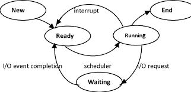
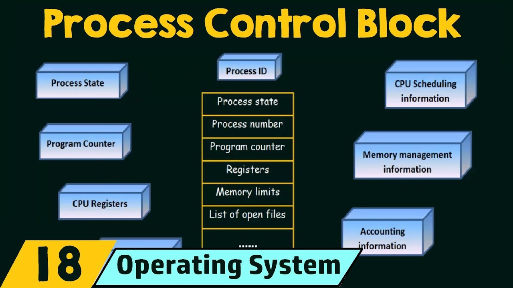
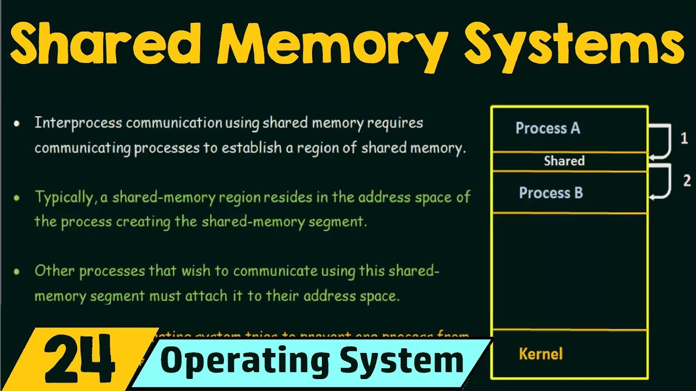
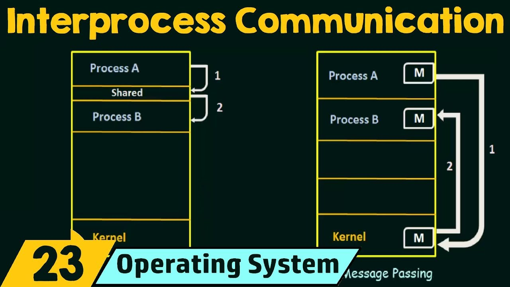

# Table of Contents

1. [Process State](#process-state)
2. [Process Control Block](#pcb)
3. [Context Switch](#context-switch)
4. [Process Creation](#process-creation)
5. [Process Termination](#process-termination)
6. [Inter-process Communication](#ipc)
   1. [Shared Memory systems](#shared-memory-system)
   2. [Message Passing systems](#mps)
      1. [Direct comms](#direct-comms)
      2. [Indirect comms](#indirect-comms)
      3. [Sync Comms](#sync-comms)
      4. [Async Comms](#async-comms)
      5. [Buffering](#buffering)


* process = program in execution, when its idle, its not usually referred to as a process.


# Process State<a name="process-state"></a>

1. defined by current activity of the process
2. new - process is being created
   running - instructions being executed
   waiting - waiting for an event to occur(I/O wait, reception of a signal)
   ready - waiting to be assigned to a processor(CPU wait)
   terminated - process has finished execution
3. 
4. new--->ready (admitted), running--->end = exit.


# Process Control block<a name="pcb"></a>

1. also called **task** control block.
2. each process represented in the OS by this.
3. 
4. *Process ID* - id of the process, unique to each process.
5. *Process state* - tells the state(the 5 kinds discussed in the above section)
6. *Program Counter* - address of the next instruction to be executed for the current process
7. *CPU registers* - which of the index registers, stack pointer registers, general purpose registers, .... being used by a process.
8. *CPU scheduling information*
   1. priority of the process
   2. pointer to scheduling queue
   3. other scheduling parameters
9. *Memory management information* - different aspects of memory being used by the process
10. *Accounting information* - resources being used(what type and how many per type) by the process.
11. *I/O Status information* - I/O devices being assigned to the process for its execution.


# Context Switch<a name="context-switch"></a>

1. [interrupts](../preliminary/README.md/#interrupts) cause OS to change their current task and run a kernel routine
   1. such operations occur frequently on general purpose systems.
2. save the current context of the process that was currently running on the CPU, so that it can be restored after an interrupt has been processed, and the execution of this process can then be resumed.
   1. context = PCB of this process.
   2. this interrupt may lead to start of execution of a new/partially completed process, hence if its a partially completed process, its PCB also needs to be restored.
3. this state-save + possible-state-restore is called context-switch.
4. here the process being restored is the one that interrupts(or calls for the interrupt) the already running one.
5. time required for this is pure overhead, typical times = few milliseconds.


# Process Creation<a name="process-creation"></a>

1. a process itself may **create new processes**, via `createProcess()` syscall , during the course of its execution.
2. creator = parent, created = child/children processes.
3. a tree-like structure/hierarchy is now formed.
4. on creation of a child process,
   1. the parent may continue to execute concurrently with the child process.
   2. the parent waits until some/all children processes finish their execution.
5. w.r.t. the address space of a child process
   1. duplicate of parent, i.e. same program, data as parent
   2. new program loaded into it.


# Process Termination<a name="process-termination"></a>

1. after completing last execution, process asks for deletion, which is triggered using `exit()` syscall.
2. this process may return a status value to its parent process, if any, via the `wait()` syscall
   1. since the parent's execution may be dependent on how the child-process's execution finished.
3. all resources allocated to this process - I/O buffers, physical and virtual memory, open files, etc. de-allocated by OS.
4. a process may also call upon termination of some other process, via an apt syscall.(kill)
   1. usually such a syscall is/*can be* invoked by  the parent process only.
5. parent terminates child process
   1. child process exceeds allocated resources(parent has to inspect the resources being allocated to the child process)
   2. task is (no longer required)/completed.
6. parent is exiting, and OS doesn't allow a child process to continue, if its parent process terminates.


# Inter-process Communication<a name="ipc"></a>

1. concurrently executing processes in the OS - independent/cooperating
2. independent - can neither affect or get affected.
   cooperating - can affect or get affected, processes that **share data**.
3. reasons for process cooperation
   1. information sharing
   2. computation speedup - divide task into concurrent sub-tasks, rather than sequential execution, and now these sub-tasks(processes) may need to comms with each other.
   3. modularity - communication of modules with one another.
   4. convenience
4. IPC comms = shared memory(shared region of memory between cooperating processes, process read and write data to shared region) + message passing(comms by messages exchanged between cooperating processes).


## Shared Memory systems<a name="shared-memory-system"></a>

1. 
2. process A will write its message(to be communicated to process B) into the shared memory region, and process B will in-turn read from the same.
3. this region usually resides in the address space of the **process creating this segment**.
   1. in the above case, Process A creates the shared segment.
4. other processes that wish to communicate using this shared-segment must attach it to their address space.
   1. here B has to attach(or add simply) the shared segment created by A, to its own address space.
5. normally the **OS prevents** one process from accessing memory of another process.
   1. if processes need to communicate in this shared memory manner, at-least 2 processes need to agree to remove this restriction.
6. the [producer-consumer problem](../processSynchronisation/README.md/#producer-consumer) is an example where IPC between the producer and consumer processes happens via the shared memory, i.e. the array.
   1. 2 kinds of buffer(for the shared buffer between producer and consumer)
      1. unbounded buffer
         1. no practical limit on the size of buffer
         2. for instance, in the producer-consumer problem, the producer may keep on producing many new items.
         3. consumer has to wait only if the buffer is empty.
      2. bounded buffer
         1. consumer has to wait only if the buffer is empty.
         2. producer has to wait if buffer is full.
         3. a practical limit on the size of buffer exists.


## Message Passing systems<a name="mps"></a>

1. 

2. particularly useful in a distributed environment, where a shared address space cannot exist since the communicating processes may reside on different systems, and these systems are connected via network.

   1. M - individual address spaces of the processes

3. `send(message)` and `receive(message)` - 2 functionalities offered by such systems. [MPI Library Doc](https://www.rookiehpc.com/mpi/docs/index.php)

4. message communicated can be **fixed**(straightforward implementation, makes the task of programming, i.e. usage of such a MPI system more difficult, for instance if a shorter message is to be communicated, unnecessary padding will be required, and if a longer message is to be communicated, it has to be broken down into pieces of this fixed size, and then comes the troubles of distributed computing w.r.t. such broken down messages)/**variable**(comple implementation, makes the task of programming, i.e. usage of such a MPI system *simpler*) **in size**.

5. message passing between process occurs on a *communication link*, <u>logical implementation</u> of this link:

   1. direct/indirect comms
   2. sync/async comms
   3. automatic/explicit buffering.

6. ```cpp
   // method signature for send in MPI 2.0 c++
   int MPI_Send(const void* buffer,
                int count,
                MPI_Datatype datatype,
                int recipient,
                int tag,
                MPI_Comm communicator);
   
   // method signature for receive in MPI 2.0 c++
   int MPI_Recv(void* buffer,
                int count,
                MPI_Datatype datatype,
                int sender,
                int tag,
                MPI_Comm communicator,
                MPI_Status* status);
   ```


### Direct Comms<a name="direct-comms"></a>

1. communicating processes must have a way of referring to each other

2. processes that wants to communicate must **explicitly mention** the **name of** the **sender and recipient**

3. as we can see in the above method signature for [MPI_Send()](https://www.rookiehpc.com/mpi/docs/mpi_send.php) the rank of the recipient-process has to be explicitly mentioned, hence making this comms **direct**.

4. as we can see in the above method signature for [MPI_Recv()](https://www.rookiehpc.com/mpi/docs/mpi_recv.php) the rank of the sender-process has to be explicitly mentioned, hence making this comms **direct**.

5. the logical link is automatically established between every pair of processes that want to communicate, and between any 2 processes, **exactly 1 link exists**.

6. **symmetry in addressing** - both sender and receiver have to mention the name of the process they are trying to  communicate with.

7. a **variant** of direct comms also exist, wherein the **sender** has to **explicitly mention** the **receiver** process, but **no need** for the receiver **to mention** the name of **the sender**. 
   `send(P, message)`, where `P` = name of receiver process
   `recv(id, message)`, where `id` = a variable which can be set to any value, depending upon whom this particular process is trying to communicate.

   When **`MPI_ANY_SOURCE`** is used as a value for the argument `sender` in the above `MPI_Recv()` call , the receiver no longer has to mention the name(**id**) of the sender process.
   this variant employs **asymmetry in addressing** .

8. for direct comms, if the way in which the identity of a process is changed, then to remain consistent,  an examination of all process definitions needs to happen, so as to record any identification(id changes) changes, if any.

   1. if suppose a sender sends a message `send(pid=1)` and the process with `pid=1` suddenly changes its id to 13, thus this means that in the communicator group, its id has to be renamed to `pid=13`, and the send function has to then be invoked in the apt manner.


### Indirect Comms<a name="indirect-comms"></a>

1. messages are sent-to/received-from *mailboxes*|*ports*.
2. mailbox - abstract object into which messages can be placed by processes, and be extracted by some other processes, each mailbox has a unique id.
3. 2 processes can communicate, only if they have a **shared mailbox**.
   `send(A, message), recv(A, message)`, where `A` = mailbox id.
4. link between processes 
   1. exists only if they have a shared mailbox.
   2. multiple links for a pair, each corresponding to the different mailbox that they share with one another.
   3. a single link may be associated with more than 2 processes.
5. scenario - P1 sends a message to A, and P2 and P3 both execute `recv(A)`, to decide which process receives this message
   1. allow a link to be associated to **at-most 2 processes**, similar to direct comms.
   2. allow at-most 1 process at a time to **execute `recv()`** .
   3. allow **system** to **select arbitrarily** which process will **receive** the message, 
      it(**system**) may also define an algorithm for selecting which process will receive the message. The system itself may identify the receiver to the sender.
6. a **mailbox** may be **owned** wither **by** a **process or** the **OS**.
   1. if its owned by a process, it will vanish when this process terminates.
   2. owning a mailbox means that this process will be receiving all the messages intended for it from different senders inside this mailbox.
   3. for an OS-owned mailbox, OS will take care of their creation/deletion.


### Synchronisation<a name="sync-comms"></a>

1. the calls `send` and `recv` may be blocking(synchronous) or non-blocking(async)

2. Sending process is blocked(after `send` no further line of code executed until receive is completed.) until the message is received either by the receiver (direct comms) or mailbox 

   ```cpp
   int MPI_Send(const void* buffer,
                int count,
                MPI_Datatype datatype,
                int recipient,
                int tag,
                MPI_Comm communicator);
   ```

   This is the signature for the blocking [MPI_Send()](https://www.rookiehpc.com/mpi/docs/mpi_send.php)

3. Blocking receive blocks the process(receiver) until a message is received, i.e. doesn't execute further lines of code unless message is received into the message buffer.

   ```cpp
   // method signature for blocking receive in MPI 2.0 c++
   int MPI_Recv(void* buffer,
                int count,
                MPI_Datatype datatype,
                int sender,
                int tag,
                MPI_Comm communicator,
                MPI_Status* status);
   ```


### Async Comms<a name="async-comms"></a>

1. the sender process sends the message and resumes operation

   ```cpp
   int MPI_Isend(const void* buffer,
                 int count,
                 MPI_Datatype datatype,
                 int recipient,
                 int tag,
                 MPI_Comm communicator,
                 MPI_Request* request);
   ```

   The above is the method signature for the non-blocking [`MPI_Isend()`](https://www.rookiehpc.com/mpi/docs/mpi_isend.php) call.

2. The receiver retrieves either a valid message or a null.

   ```cpp
   int MPI_Irecv(void* buffer,
                 int count,
                 MPI_Datatype datatype,
                 int sender,
                 int tag,
                 MPI_Comm communicator,
                 MPI_Request* request);
   ```

   [`MPI_irecv`](https://www.rookiehpc.com/mpi/docs/mpi_irecv.php)


### Buffering<a name="buffering"></a>

1. messages exchanged between processes reside in a **temporary queue**.
2. 0 capacity buffer
   1. the size of queue = 0, i.e. the link can;t have any messages waiting in it, sender must block(if not, the sender might send a new message, and it may so happen that the first message is not yet received by apt receiver, ) until the recipient receives the message.
3. bounded capacity buffer
   1. queue has finite length, thus at-most n messages can reside in it.
   2. if its not full, a process can place its message in the queue and can send more(**no blocking required**, till it becomes full.
   3. after its full, sender must block until space is made available in the queue.
4. **un**bounded capacity buffer
   1. length of the queue logically infinite, any number of messages can be accommodated in it, hence the sender never has to block.


# Sockets<a name="sockets"></a>

1. mainly used for client-server based systems.


