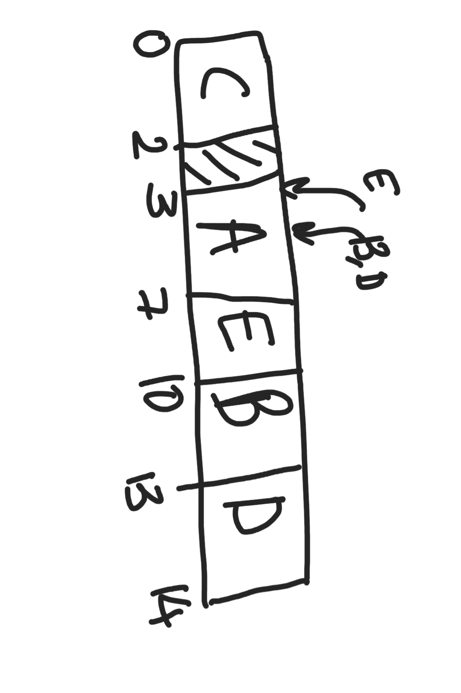
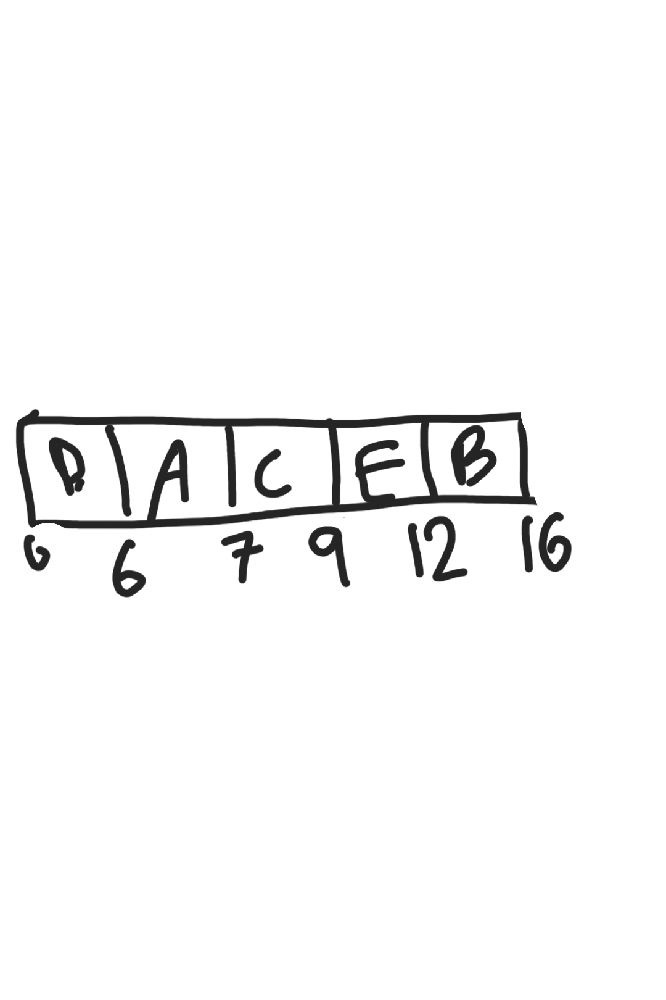
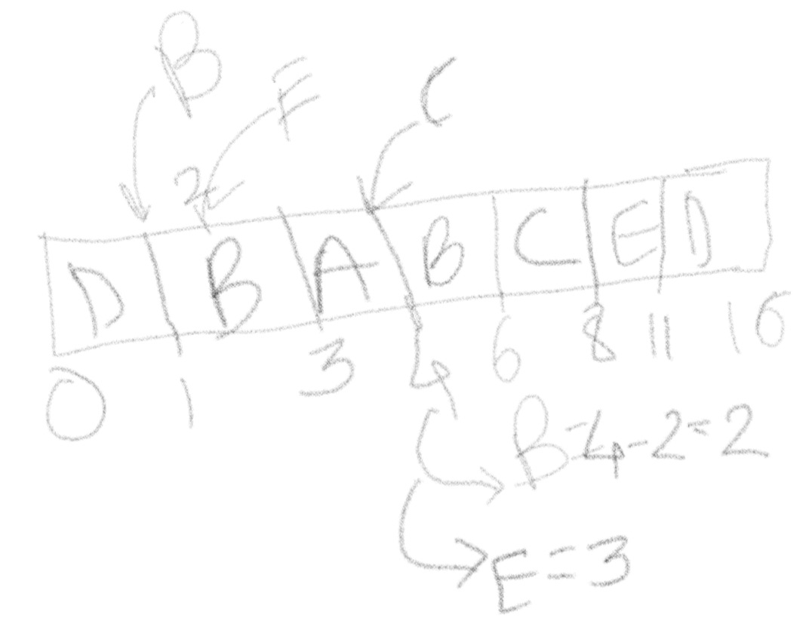
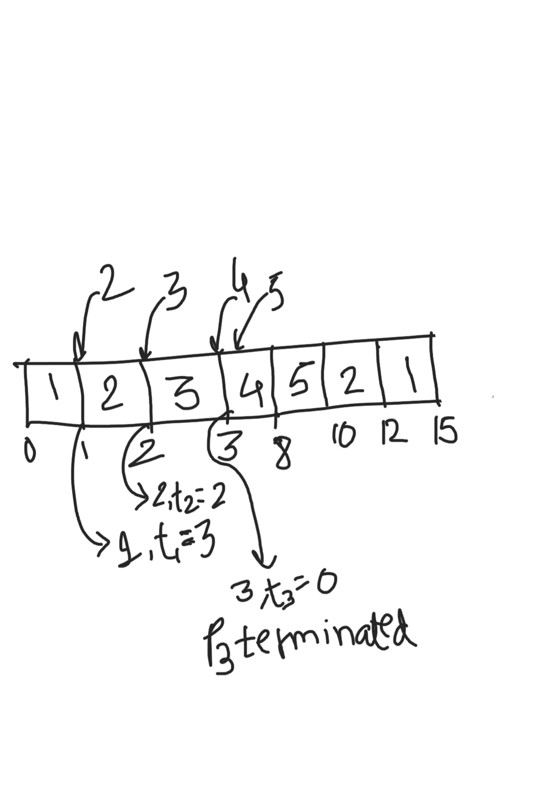
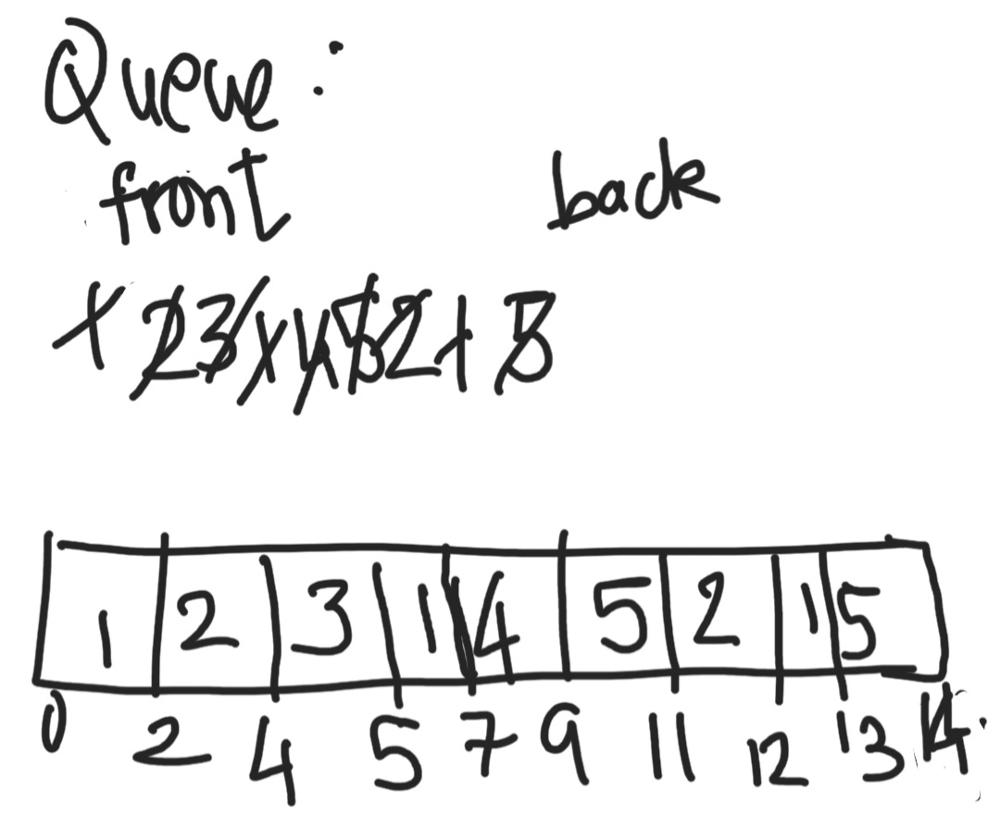
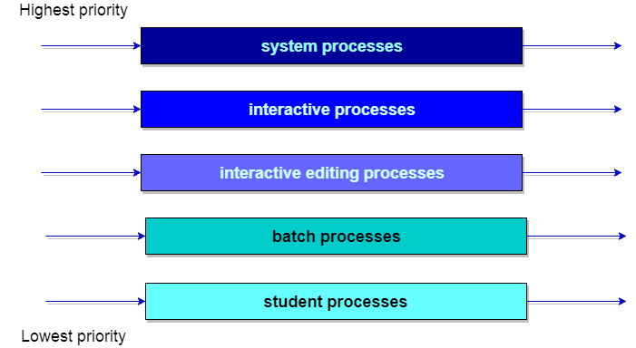

# Table of Contents

1. [Introduction](#cpu-scheduling-introduction)
   1. [Pre-emptive vs Non pre-emptive scheduling](#pre-emptive_scheduling)
   2. [Terminology](#cpu-scheduling-terminology)
   3. [Criteria for CPU scheduling algorithm](#algo-criterion)
2. [FCFS](#fcfs)
3. [Convoy effect](#convoy-effect)
4. [Shortest job first scheduling](#sjf)
5. [Priority Scheduling Algorithm](#priority-scheduling)
   1. [Advantages](#priority-adv)
   2. [Disadvantages](#priority-disadv)
6. [Round-robbin algorithm](#rr-alg)
   1. [Advantages](#rr-adv)
   2. [Disadvantages](#rr-disad)
7. [Multi-level queue scheduling](#mlqs)
8. [Multi-level feedback queue scheduling](#mlfqs)

# Introduction

1. process execution = cycle(CPU + I/O) = CPU-burst(start) + I/O burst + CPU-burst + I/O burst + .....
2. CPU bound process
   1. CPU is major requirement
   2. spends most of the time on CPU
3. I/O bound process
   1. spends most of the time in I/O
   2. minor requirement of CPU

## Pre-emptive vs Non pre-emptive scheduling

1. Non pre-emptive
   1. a CPU cannot be taken from a **running process** and given to an idle one
   2. CPU can be taken away only if the process currently using it has completed its execution
   3. when a process leaves the CPU **voluntarily** to perform I/O operation(essence of multi-programming)
2. Pre-emptive
   1. a CPU can be taken from a **running process** and given to an idle one
   2. when  a lower priority process occupies the CPU and a higher priority process enters the waiting queue in main-memory
   3. used also in round-robin, process switching from running to ready due to expiration of time-quantum.

## Terminology

1. burst time
   1. process requires for running CPU
   2. running time/CPU time
   3. depends on the incoming process, cannot be determined beforehand ever, practically
2. waiting time
   1. time spent by a process in ready state **waiting for CPU**
   2. time spent being in the *ready queue*
3. arrival time
   1. enters into ready state
4. exit time(E.T.)
   1. process completes execution and exits from the system
   2. terminating time
5. turn around time
   1. total time spent in the system, before being thrown out
   2. T.A. = E.T. - A.T. = B.T. + W.T.
6. response time
   1. time between a process enters the ready queue and get scheduled on the CPU **for the first time** .

## Criteria for CPU scheduling algorithm

1. Average waiting time
   1. for all processes, calculate total waiting time, then divide by total number of processes
   2. the lesser, the better the algorithm
2. Average response time
   1. for all processes, calculate total response time, then divide by total number of processes
   2. for example, consider web-page loading of www.facebook.com
      1. users will stick to the website only if they are being responded continually, i.e. even on a slow internet connection, they should be able to see each component as and when it is being loaded
      2. instead of the user seeing a blank screen for an unknown amount of time, until all the stuff loads at the same time
3. CPU utilisation
   1. should be engaged for the maximum time
4. Throughput
   1. more number of processes should complete execution per unit time

# FCFS

1. assigns CPU to process based on arrival time

2. easily implementable using queue data-structure

3. always non-preemptive in nature

4. | process id | arrival time | burst time | turn around time = exit - arrival | waiting time = TAT - B.T. |
   | ---------- | ------------ | ---------- | --------------------------------- | ------------------------- |
   | A          | 3            | 4          | 7-3 = **4**                       | 4 - 4  = 0                |
   | B          | 5            | 3          | 13 - 5 = **8**                    | 8 - 3 = 5                 |
   | C          | 0            | 2          | 2 - 0 = **2**                     | 2 - 2 = 0                 |
   | D          | 5            | 1          | 14 - 5 = **9**                    | 9 - 1 = 8                 |
   | E          | 4            | 3          | 10 - 4 = **6**                    | 6 - 3 = 3                 |

5. Gantt chart:
   

6. uni-processing is assumed

7. Advantage

   1. simple, easy to use, easy to understand, easy to implement, used for background processes where execution is not urgent

8. Disadvantage

   1. suffers from convoy effect
   2. normally higher average waiting time
   3. no concern to priority/small burst time
   4. shouldn't be used for **interactive** systems

# Convoy Effect

1. processes with short burst time have to wait longer, since they had arrived later

Starvation - when processes with low priority/high burst time/lower order of precedence get blocked indefinitely, due to continual arrival of higher processes, thus not getting CPU ever.

# Shortest job first scheduling

1. CPU assigned to process having the **least burst time**

2. non-preemptive - CPU not preempted from a process that currently occupies it **even on the arrival of a process with a shorter burst time**

3. preemptive - CPU **is** preempted from a process that currently occupies it , on the arrival of a process with a shorter burst time

4. | pid  | arrival time | burst time |
   | ---- | ------------ | ---------- |
   | A    | 3            | 1          |
   | B    | 1            | 4          |
   | C    | 4            | 2          |
   | D    | 0            | 6          |
   | E    | 2            | 3          |

5. by default, if not mentioned, use non-preemtpive

   1. if the words **shortest remaining time first** - SRTF - preemptive SJF

6. non preemptive

   1. 

   2. | pid  | arrival time | burst time | T.A.T.      | W.T. |
      | ---- | ------------ | ---------- | ----------- | ---- |
      | A    | 3            | 1          | 7-3 = **4** | 3    |
      | B    | 1            | 4          | 16-1=15     | 11   |
      | C    | 4            | 2          | 5           | 3    |
      | D    | 0            | 6          | 6           | 0    |
      | E    | 2            | 3          | 10          | 7    |
      
   3. Average WT = 3+11+3+0+7/5 = 4.4

7. preemptive

   1. 

   2. | pid  | arrival time | burst time | T.A.T.      | W.T. |
      | ---- | ------------ | ---------- | ----------- | ---- |
      | A    | 3            | 1          | 7-3 = **4** | 3    |
      | B    | 1            | 4          | 16-1=15     | 11   |
      | C    | 4            | 2          | 5           | 3    |
      | D    | 0            | 6          | 6           | 0    |
      | E    | 2            | 3          | 10          | 7    |

   3. SRTF guarantees **MINIMAL AVERAGE WAITING TIME**, this is a purely greedy strategy

8. Advantages

   1. better average response time than FCFS

9. Disadvantages

   1. starvation of higher burst time(CPU bound processes are penalised, and less preferred than I/O bound processes)
   2. CPU burst cannot be predicted correctly, hence algorithm cannot be perfectly implemented ever
   3. no idea of priority, no scope of priority

# Priority Scheduling Algorithm

1. FCFS - priority = order of incoming process
   SJF - priority = shortest remaining time

2. here priority is explicitly mentioned, whereas in the above 2 algorithms, priority was implied.

3. usually high priority processes - responsible for maintenance of the system

   1. giving it a higher priority means providing it CPU and other resources, which will in turn ensure the well-being of the entire system itself

4. can be preemptive and non-preemptive.

5. non-preemptive

   | id   | AT   | BT   | Priority | TAT(ET - AT) | WT(TAT-BT) |
   | ---- | ---- | ---- | -------- | ------------ | ---------- |
   | 1    | 0    | 4    | 2        | 4            | 0          |
   | 2    | 1    | 3    | 3        | 15-1=14      | 14-3=11    |
   | 3    | 2    | 1    | 4        | 12-2=10      | 10-1=9     |
   | 4    | 3    | 5    | 5        | 9-3=6        | 6-5=1      |
   | 5    | 4    | 2    | 5        | 11-4=7       | 7-2=5      |

    **assumption** : higher priority means that the number associated to the priority is greater.
   If processes **tie w.r.t. priority**, then CPU is assigned based on **FCFS, i.e. arrival time**.

   Average WT = 11+9+1+5/5 = 5.2
   Average TAT = 4+14+10+6+7/5 = 8.2

6. preemptive

   

   | id   | AT   | BT   | Priority | TAT(ET - AT) | WT(TAT-BT) |
   | ---- | ---- | ---- | -------- | ------------ | ---------- |
   | 1    | 0    | 4    | 2        | 15-0=15      | 15-4=11    |
   | 2    | 1    | 3    | 3        | 12-1=11      | 11-3=7     |
   | 3    | 2    | 1    | 4        | 3-2=1        | 1-1=0      |
   | 4    | 3    | 5    | 5        | 8-3=5        | 5-5=0      |
   | 5    | 4    | 2    | 5        | 10-4=6       | 6-2=4      |

   Average WT = 11+7+0+0+4/5 = 4.4
   Average TAT = 15+11+1+5+6/5 = 7.6

## Advantages

* priority for system processes
  * operating system processes should never starve, since their main job is of system-maintenance
  * there may be system processes like *paging handler* , *CPU scheduler*  and so that these get high priority, this type of scheduling algorithm is very essential
  * 
* allows to run more important processes
  * hence user processes can be given special priority, if they are that important.

## Disadvantages

* process(es) with small priority may starve for the CPU
  * since processor is biased, starvation was bound to happen in the first place
* no idea of response and waiting time
  * this algorithm doesn't take them into consideration, hence both average response and average waiting times aren't that good to begin with
* Ageing:
  * a way of counteracting starvation of a low priority process by increasing its priority at regular intervals of time.

# Round-robin algorithm

1. divide CPU time amongst process(es) in the ready state

   1. in reality, we don't complete an entire process and then move onto the other process
   2. if it were so. then we could not have used multiple processes of a computer such as browser, terminal, movie player at the same time

2. processes that are ready for CPU consumption are generally stored in a circular-queue

3. good average response time

4. each process has a time-quantum, which is a time value upto which the CPU will be occupied by this process.

   1. once this quantum expires, the process is pushed out of the queue
      1. if the process terminates before the expiration of its time quantum
   2. if needed, it finishes any I/O tasks
   3. it is appended at the end of this circular queue, once it becomes ready

5. always preemptive in nature
   

6. | id   | AT   | BT   | TAT     | WT     |
   | ---- | ---- | ---- | ------- | ------ |
   | 1    | 0    | 5    | 13-0=13 | 13-5=8 |
   | 2    | 1    | 3    | 12-1=11 | 11-3=8 |
   | 3    | 2    | 1    | 5-2=3   | 3-1=2  |
   | 4    | 3    | 2    | 9-3=6   | 6-2=4  |
   | 5    | 4    | 3    | 11-4=7  | 7-3=4  |

   time-quantum = 2
   **Best way to solve is by maintaining a queue**

## Advantages

* performs **best** in terms of **response time**
* works well in case of time-sharing system, client-server architecture, and interactive-based systems
* kind of SJF implementation

## Disadvantages

* longer process may starve
  * i.e. CPU bound processes, processes which have high CPU burst time
* performance depends heavily on time quantum
  * too short - **time wasted in rapid context switches**
  * too long - **becomes FCFS**
* no idea of priority - hence not to be used if priority-based scheduling is of importance.

# Multi-level queue scheduling

1. processes are classified into different groups.
   1. **interactive/foreground** processes - direct interaction with the user, thus need to be quick.
   2. **background/batch** processes - since not in direct interaction with user, can be comparatively slower.
   3. these 2 have different response time requirements(obviously :laughing: ) , thus have different scheduling needs.
   4. foreground processes may have priority over bg processes.
2. this type of scheduling partitions the ready queue into several separate queues.
3. now processes are assigned to these partitioned-ready queues based on some property, like memory size, process priority, process type.
4. each queue has its own scheduling algorithm.
   1. for instance, separate queues may be used for fg and bg processes, where fg queue = RR(since we need to maximize response time), bg queue = FCFS(since response doesn't matter, but no process should be starved) .
5. in addition to scheduling within each queue, *scheduling amongst these queues* should also exist
   1. commonly implemented as a [fixed-priority preemptive scheduling](#priority-scheduling).
   2. for example FG queue absolute priority over BG queue.
6. 
   1. each of the above is  a queue.
   2. a lower priority queue may not be able to execute, unless an until all the processes in the upper queues are executed(i.e. emptied)
   3. if, w.r.t. a lower queue, suppose all upper queues were empty, such that a process in this queue was currently occupying the CPU, and now if any higher priority process arrives, the CPU will be preempted from this and be given to this newly arrived high priority-process. the lower queue process resumes its execution after this newly arrived process finishes its own execution.

# Multi-level feedback queue scheduling

