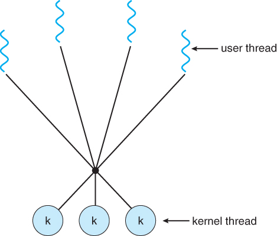
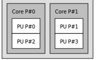

# Table of Contents

1. [Introduction](#introduction)
2. [Benefits of Multi-threaded programming](#multi-threaded-benefits)
3. [Multi-threading Models](#multi-threading-models)
4. [Hyper-Threading](#hyperthreading)
5. [Memory management in threads](#memory-management-threads)
6. [`fork` System call](#fork)
7. [`exec()` System call](#exec)
8. [Threading Issues](#threading-issues)


# Introduction<a name="introduction"></a>

1. threads = basic unit of execution, within a process.
   1. a process can have 1-many threads.
2. thread = thread ID + program counter + register set + stack.
3. a thread shares its code section, data section, other OS resources with other threads **belonging to the same process**.
4. traditional/heavyweight process - single thread.(called as single thread of control)
   1. A thread is also known as lightweight process
5. if a process has multiple threads , can perform more than 1 task at a time.
6. 
7. as mentioned before, threads of the same process share code+data+files, **but registers and stacks** are unique to the thread.


# Benefits of Multi-threaded programming<a name="multi-threaded-benefits"></a>

1. **increased responsiveness to the user**, since some threads may be running, while other might either be blocked, or performing some lengthy operation/computation.
2. **resource sharing**(among threads), several threads of activity within the same address space.(each process would have had to be allocated different address spaces)
3. **economy** - allocating memory and resources for process creation is costly, and since threads share resources of a process, its more economical to create and context-switch threads.
4. **utilisation of multi-processor architectures** - threads may be running in parallel on different processors. 
   1. a single threaded process can be run on only 1 processor(no matter how many processors are available)
   2. multi-threading this way increases the concurrency.


# Multi-threading Models<a name="multi-threading-models"></a>

1. 2 types of threads
   1. user threads - supported above the kernel and are managed without kernel support.
   2. kernel threads - supported and managed directly by the OS.
2. **Many to One model**
   1. 
   2. many user threads are accessing a kernel thread.
   3. thread management is done by the thread library in **user space(and not in the kernel level)**, thus making it efficient.
   4.  the entire process will block if a thread makes a blocking system call(the user-thread issuing the blocking call leads to the kernel thread being blocked, which further leads to all the other user-threads mapped to this kernel thread being blocked).
   5.  since only 1 thread can access the kernel at a time, multiple threads are unable to run in parallel on multi-processors, this is because 1 kernel thread will be running only on 1 processor, thus in-turn all of these user-threads mapped to this kernel thread will be running on that same processor, thus no parallel processing.
3. **One to one model**
   1. 
   2. 1 user thread mapped to exactly 1 kernel thread.
   3. now, if a thread makes a blocking system call, only that thread gets affected, since its mapped kernel thread is no longer mapped to any other user-thread, the other parts of this entire process(unaffected user threads) can continue their execution.
   4. allows multiple threads to run in parallel in a multi-processor environment, since each kernel thread can be run on a separate processor, thereby making each user thread run on different processors.
   5.  creating a user thread requires the creation of a corresponding kernel-thread.
   6.  overhead of creating a kernel thread may **burden the performance of an application** most implementations of this model restrict the number of threads supported by the system.(suppose system with 4 cores, then at-max 4 pairs of user-kernel threads can be created for a process.)
4. **Many to Many model**
   1. 
   2. *u* user threads mapped to *k* kernel thread, u &ge; k, this k is application/system specific
   3. the developer can create as many user threads as required, **since there is no obligation over the number of kernel threads that should exist**.
   4. the corresponding kernel threads can run in parallel on a multi-processor.
   5. if a user thread performs a blocking system call, the kernel can schedule another thread for execution.


# Hyper-Threading/Simultaneous Multi-threading<a name="hyperthreading"></a>

1. hyperthreading - name given by Intel.
2. such systems allow the cores of their processors to become multiple logical processors(a single core, although physically 1 processor, becomes logically > 1 processors, hence multiple threads of the same process can be now run on this physically-1/logically L processors), thus causing a performance boost.
3. to check hyperthreading in ubuntu , check the file : `/sys/devices/system/cpu/smt/active` (if 1, its enabled, else disabled).
4. commands like
   1. `lstopo`  - the Core P#... tells us how many physical cores there are, and the PU P# tells us the logical processors
      
   2. in the output from `lscpu` , total logical processors(CPU(s) is the output field in this command's output) = Thread(s) per core x Core(s) per socket x Socket(s) . Even in this , we get = 2 x 2 x 1 = 4.
      [link for interpretation](https://baiweiblog.wordpress.com/2017/10/27/how-many-physical-and-logical-cpu-cores-in-your-computer/#:~:text=Hence%2C%20the%20computer%20has%2016%20physical%20cores%20in%20total.&text=Each%20physical%20CPU%20core%20can%20run%202%20threads.&text=These%20threads%20are%20the%20core's,%C3%97%20threads%20per%20physical%20core.)


# Memory management in threads<a name="memory-management-threads"></a>

* In general each *thread* has its own registers (including its own program counter), its own stack pointer, and its own stack. 
* **Everything else is shared** between the threads sharing a process.
* In particular a *process* is generally considered to consist of a set of threads sharing an address space, heap, static data, and code segments, and file descriptors.
  * There is some additional process state shared by all the threads in a process, things like the process id, the signal handling, and file locks.
* Most modern operating systems have added a notion of [*thread local storage*](https://en.wikipedia.org/wiki/Thread-local_storage), which are variables of global scope that are not shared. 
  * The usual example of the use of this is for the variable `errno`. 
  * That's a single variable of global scope, but in most modern operating systems each thread is given its own local copy, so that an error in a library call on one thread won't impact the behaviour of other threads.
* when a function is called from a thread, Stack variables are copied but heap variables are same.


# `fork` System call<a name="fork"></a>

1. creates a separate, duplicate process(child - duplicate, parent process - the creator).

2. ```c
   fork();
   printf("ID = %d\n", getpid());
   
   /*
   output:
   ID = 5678
   ID = 5679
   */
   ```


   ```c
   #include<stdio.h>
   #include<sys/types.h>
   #include<unistd.h>
   
   int main(){
   	fork();
   	fork();
   	printf("ID = %d\n", getpid());
   	return 0;
   }
   /*
   output:
   ID = 6908
   ID = 6910
   ID = 6909
   ID = 6911
   */
   ```

3. this goes to show that

   1. at first fork the main process creates a child process, hence there are 2 processes now in the system
   2. now the second fork() call is executed **by both the parent and the newly created child process**, hence both form their duplicates, thus making a total of 4 processes in the system
   3. if suppose an extra `fork()` call was written, all these 4 would duplicate themselves, thus having 8 processes in the system.

4. 


# `exec()` System call<a name="exec"></a>

1. program specified as a parameter in this call will replace the entire process, including all threads.

2. contrary to `fork()`, replacement of processes occurs,  

3. **`tp.c`** :

   ```c
   #include<stdio.h>
   #include<sys/types.h>
   #include<unistd.h>
   
   
   int main(){
   	printf("ID = %d\n", getpid());
   	char *args[] = {"Hello", "Bhai!!!!", NULL};
   	execv("./timePass", args);
   	printf("Back to tp.c\n");
   	return 0;
   }
   ```

   **`timePass.c`**:

   ```c
   #include<stdio.h>
   #include<sys/types.h>
   #include<unistd.h>
   
   int main(int argc, char *argv[]){
   	printf("Hello timePass\n");
   	printf("timePass ID = %d\n", getpid());
   	return 0;
   }
   ```

4. to compile

   1. the default binary file created is `a.out`

   2. but we need both files to have different binary file names, so 

      ```bash
      gcc tp.c -o tp
      gcc timePass.c -o timePass
      # the name of the output binary file has to be timePass, since that is the same name that we are using in the execv("./timePass") function, inside tp.c
      ```

   3. now, `./tp` will execute its first line, then the `execv()` takes over, executing the `timePass.c` and gets back to `tp.c`

   4. ```bash
      ID = 7251
      Hello timePass
      timePass ID = 7251
      ```

   5. here, **one thing to note is the same PID**, thus relaying us the fact that `execv` actually **replaces the contents of the process, but not details like ID**.


# Threading Issues<a name="threading-issues"></a>

1. the semantics of `fork()` and `exec()` syscalls change in multi-threaded environment.
   1. if a thread of a process calls `fork()` is the entire process duplicated, resulting in duplication of all threads, or is this new process a single-threaded one, thus replicating only this particular thread?
   2. some UNIX systems have **both** `fork()` versions
      1. duplication of all threads
      2. duplication of the `fork()` caller thread.
   3. if a thread of a process invoked the `exec()` syscall, the program specified in the `exec()` as a parameter will replace the current process entirely, **including all its current threads**.