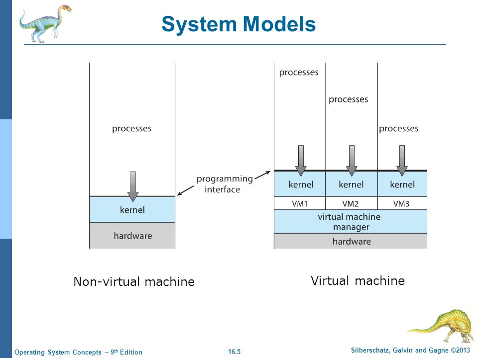

# Table of Contents

1. [Introduction](#vmintro)

# Introduction

1. abstract the hardware(CPU, memory, disk drives,network interface cards) of a single computer into several **execution environments** thereby creating an illusion that each separate execution environment is running its own private computer
2. 
3. virtual machine *software* - kernel mode,  virtual machine itself - is an application program, hence *user-mode*
4. each VM will obviously have its own kernel(virtual-kernel)+user(virtual-user) mode
5. each VM has some portion of the disk assigned to it(mini-disk), and these portions are isolated from each other
6. 