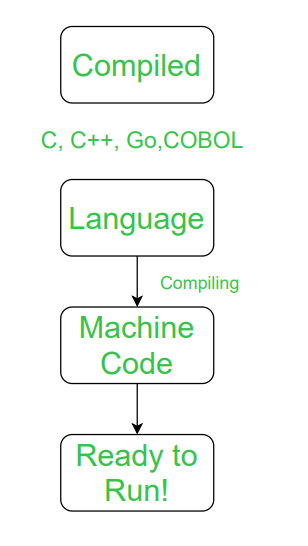
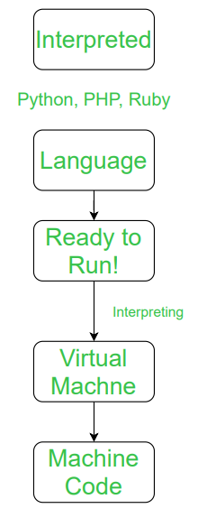

# Table of Contents

1. [Compile-time vs Runtime](#crt)
2. [Statically types vs Dynamically typed language](#stdt)
3. [Compiled Type languages vs Interpreted-type Languages](#ctit)
   1. [A simple analogy](#compiled-vs-interpreted-analogy)
   2. [Differences](#compiled-vs-interpreted-differences)
   3. [Intermediate Approach](#ia)

# Compile-time vs Run-time

1. compile-time:
   1. instance where code  is converted to executable
   2. error occurred due to typing mistake, if we do not follow the proper **syntax** and **semantics** of any programming language then compile time errors are thrown by the compiler. 
   3. code is run, only after syntax-errors are rectified, 
2. run-time:
   1. instance where the executable is run

# Statically types vs Dynamically typed language

| Statically types                                             | Dynamically typed                                            |
| ------------------------------------------------------------ | ------------------------------------------------------------ |
| programmer must specify what type each variable is(eg Java, C, C++) | type is associated with run-time values, and not named variables/fields/etc.  programmer can write a little quicker because you do not have to specify types every time (unless using a statically-typed language with *type inference*). |
| some languages offer some form of *type inference*, the capability of the type system to deduce the type of a variable (e.g.: OCaml, Haskell, Scala, Kotlin) | Most scripting languages have this feature as there is no compiler to do static type-checking anyway, but you may find yourself searching for a bug that is due to the interpreter misinterpreting the type of a variable.  Luckily, scripts tend to be small so bugs have not so many places to hide. |
| The main advantage here is that all kinds of checking can be done by the compiler, and therefore a lot of trivial bugs are caught at a very early stage. | Most dynamically typed languages do allow you to provide type information, but do not require it. |

# Compiled Type languages vs Interpreted-type Languages

## A simple analogy

Imagine you have a hummus recipe that you want to make, but it's written in ancient Greek. There are two ways you, a non-ancient-Greek speaker, could follow its directions.

The first is if someone had already translated it into English for you. You (and anyone else who can speak English) could read the English version of the recipe and make hummus. Think of this translated recipe as the *compiled* version.

The second way is if you have a friend who knows ancient Greek. When you're ready to make hummus, your friend sits next to you and translates the recipe into English as you go, line by line. In this case, your friend is the interpreter for the *interpreted* version of the recipe.

## Differences

| Compiled type                                                | Interpreted Type                                             |
| ------------------------------------------------------------ | ------------------------------------------------------------ |
| a program called the **compiler** goes through a written source code, and ***translates*** it into machine code, in a separate file(executable) | code is *interpreted* through line by line, it isn't translated and separate into machine code, in a separate file This is what an **interpreter** does. |
| this executable can then be shared among different devices, and each of these receiving devices can run this, without ever needing the source code on the system | code is interpreted *on the fly*                             |
|                                                              | eg. JavaScript, since code for each website is sent when a request is made to that website through a browser, and the interpreter in the browser understands this code and translates it into whatever we see. |
|  once compiled, ready to run, send executable all over, for other machines to run, rather than sending the code itself  can be optimised for CPU, hence faster  source code can be **kept private**, the executable can be made public. |   cross-platform, since the source code is the one being sent, which should in-principle be acceptable by various *kinds of machine*  simpler to test(no in-between compile step)  easier to debug(since all access to source-code) |
|  not cross-platform, i.e. if OS changes(from windows to MAC), executable file won't work across these(even on the same platform it sometimes needs to be compiled separately, because of this cross-platform issue)   inflexible  compilation is an extra-step that the developer has to take in-order to test it, |  have to have an interpreter to understand and execute the code  often slower, every time a program is to be run, this *interpretation* step is needed to be carried out  source code is public |
| eg. C, C++ objective-C                                       | eg. PHP, JavaScript, most command line tools, CLIs, and shells can theoretically be classified as interpreted languages, *python in an interactive mode* |
|                                    |                                 |

## Intermediate Approach

1. compile the code into an *intermediate language*
   1. translate the source code along a way to machine code, while still being portable in cross-platforms
2. distribute this *intermediate language* to the client, who will then run it, via translating this into a complete machine code format
   1. just-in-time or JIT compilation
3. intermediate language = *Byte-code*
4. **Java**, C#, VB.NET, **Python**
   1. Java:
      1. compiled into bytecode by JRE(java runtime environment)
      2. bytecode then interpreted by jvm(java virtual machine)

